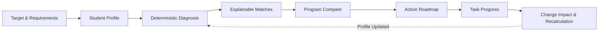

# Fortech

Fortech turns university admission requirements and a student's current profile into an explainable diagnosis, university recommendations, comparison, and a personalized action roadmap.

> **Fit Score measures profile alignment, not admission probability.**
> Admissions facts are deterministic. AI explains and advises, but never invents requirements, changes deadlines, or fabricates admission chances.

---

## Live Product

| Resource | Link / Value |
| :--- | :--- |
| **Production URL** | [https://fortechedu.vercel.app/](https://fortechedu.vercel.app/) |
| **GitHub Repository** | [https://github.com/Fortech-edu/fortech-edu](https://github.com/Fortech-edu/fortech-edu) |
| **Competition** | **LOCUS Startup Hackathon 2026** |
| **Case** | **Case 02 — Personal Admission Journey** |
| **Submission Code** | `LOCUSCASE2` |

---

## Problem

Applying to top undergraduate programs abroad is overwhelming and opaque. Applicants do not need another passive catalog of universities. They need definitive answers to five practical questions:

1. **Which programs actually fit my current profile today?**
2. **Why am I recommended a specific program over another?**
3. **Which official requirements do I already meet, and which are still missing?**
4. **What should I do next to close the gap?**
5. **How will improving a score or grade alter my admission position?**

University admissions websites are fragmented across disparate program pages, faculty guidelines, fee schedules, and international student portals. Requirements are expressed in different grading systems and test standards, making it nearly impossible for high school students to translate raw guidelines into an actionable, priority-ordered preparation plan.

---

## Solution

Fortech structures admissions into **one continuous, explainable journey**:



1. **Target & Requirements:** Select a target university first and review published thresholds before entering personal data.
2. **Profile:** Enter academic baseline and preferences. Unknown items remain explicitly `Unknown`—never penalized.
3. **Diagnosis:** Run deterministic gap analysis identifying confirmed gaps, items needing verification, and the immediate next move.
4. **Matches:** Explore recommendations ranked by eligibility and normalized Fit Score, supported by concrete evidence tiles.
5. **Compare:** Evaluate two programs side-by-side across deadlines, academics, test thresholds, and tuition.
6. **Roadmap:** Receive a structured, stage-ordered action roadmap derived directly from confirmed gaps and official requirements.
7. **Progress:** Check off completed tasks with persistent state saved locally, which may be synchronized through Supabase when cloud sync is configured.
8. **Recalculation:** Update any profile score (e.g., retaking IELTS from 5.5 to 6.5) to immediately inspect the **Change Impact** across diagnosis, recommendations, and roadmap priorities.

Fortech creates an **action path**, not just passive recommendations.

---

## Demo Scenario

Judges can verify the entire connected product loop using verified production program data:

### Step-by-Step Walkthrough

1. **Open Fortech:** Visit [https://fortechedu.vercel.app/](https://fortechedu.vercel.app/) (or your local environment at `http://localhost:3000`).
2. **Select Target on Landing:**
   - University: `LUT University`
   - Program: `Software and Systems Engineering` (Bachelor of Science in Technology, Finland)
   - Inspect verified target facts: Published IELTS requirement of **6.5 minimum**, tuition of **EUR 12,000 / year**, and deadline of **2027-04-30**.
3. **Enter Initial Student Profile:**
   - Current stage: `Grade 11`
   - GPA: `3.6` (out of 4.0)
   - IELTS: `5.5` *(intentionally below the 6.5 threshold)*
   - SAT: *leave blank (SAT is not mandatory for LUT)*
   - Click **Build my full plan** to transition seamlessly into Missing Details.
4. **Complete Profile Preferences:**
   - Target intake: `Fall 2027`
   - Country preferences: `Finland`, `Netherlands`
   - Annual budget: `USD 20,000 / year`
   - Click **Generate my admission plan**.
5. **Inspect Deterministic Diagnosis:**
   - **Confirmed Gap:** IELTS score of 5.5 is flagged with **Action needed** against the 6.5 requirement.
   - **Next Action:** Clear prompt to prepare for an IELTS retake to reach the 6.5 threshold.
6. **Consult the AI Advisor:**
   - Review structured server-side analysis: summary of current standing, key academic strengths, uncertainties, preparation priorities, and actionable next steps.
7. **Explore Matches:**
   - Review ranked program matches with visible Fit Score breakdowns and eligibility badges.
   - Expand at least 3 cards (e.g., *LUT University Software & Systems Engineering*, *University of Twente Technical Computer Science*, and *Astana IT University Computer Science*) to inspect individual criteria evidence.
8. **Compare Two Programs:**
   - Select *LUT University* and *University of Twente* for side-by-side comparison.
   - Review differences in language criteria, tuition currency, and timeline status.
9. **Open the Priority Roadmap:**
   - Observe Phase 1 prioritizing **IELTS Preparation** as the immediate high-priority blocker.
10. **Test Dynamic Recalculation (Change Impact):**
    - Return to **Profile** (via navigation or Onboarding).
    - Update IELTS from `5.5` to `6.5`.
    - Save changes: observe the **Change Impact** banner highlighting that the language gap is closed.
    - Review the updated Diagnosis: status transitions from *Action needed* to *Match*.
    - Review the recalculated Roadmap: observe the resolved language gap and the resulting deterministic changes to Diagnosis, Change Impact, and Roadmap priorities.

---

## Key Features

- **Instant Admission Check:** Previews target requirements and deterministic gaps directly from the landing page.
- **Requirements-First Target Selection:** Choose a target program from verified records and review official requirements before sharing personal data.
- **Student Profile:** Collects academic baseline (GPA, IELTS, SAT), direction (degree level, field), preferences (intake, countries, budget), and activities context.
- **Deterministic Gap Diagnosis:** Exact comparison across all published criteria. Distinguishes between *Match*, *Action needed*, and *Needs verification*.
- **Explainable Matches:** Viable programs ordered by eligibility status, normalized Fit Score (0–100), and data coverage percentage.
- **Fit Score Breakdown:** Clear multi-factor evaluation across study field, academics, tuition budget, language, country preference, and timeline.
- **Data Coverage Index:** Transparently displays what percentage of criteria could be evaluated based on provided information.
- **Side-by-Side Comparison:** Direct comparison between two selected programs across deadlines, requirements, tuition, and eligibility.
- **Personalized Action Roadmap:** Phase-ordered preparation tasks (Early Preparation, Testing & Credentials, Application & Verification).
- **Immediate Next Action:** Prominently highlights the single highest-leverage task required to improve admission standing.
- **Progress Tracking:** Progress is persisted locally and may be synchronized through Supabase when cloud sync is configured.
- **Change Impact & Recalculation:** Real-time analysis of what changes when a test score, budget, or target changes.
- **Diagnosis AI Advisor:** Constrained server-side advisor providing structured guidance without altering admissions truth.
- **Official Source Provenance:** Direct URLs to official university course pages, tuition sheets, and application guides.
- **Honest Unknown Handling:** Missing facts remain *Unknown* / *Needs verification*; missing information never penalizes the user.
- **Responsive Mobile UX:** Full navigation, touch-friendly form controls (minimum 44px height), and clean layout down to 390px mobile screens.

---

## How Fortech Makes Decisions

Fortech strictly separates **deterministic admissions logic** from **generative AI explanation**:

```
┌──────────────────────────────────────────────────────────┐
│              DETERMINISTIC ADMISSIONS ENGINE             │
│                      (lib/admissions)                    │
├──────────────────────────────────────────────────────────┤
│  • Requirement Comparison (Academics, Tests, Tuition)   │
│  • Fit Score Calculation (0–100 Normalized)             │
│  • Data Coverage Index (% of Known Criteria)             │
│  • Eligibility Classification (Eligible, Action needed)  │
│  • Recommendation Ranking & Program Filtering            │
│  • Roadmap Phase & Task Prioritization                  │
│  • Change Impact & Baseline Delta Calculation            │
└────────────────────────────┬─────────────────────────────┘
                             │ Trusted Context
                             ▼
┌──────────────────────────────────────────────────────────┐
│                   DIAGNOSIS AI ADVISOR                   │
│                        (lib/ai)                          │
├──────────────────────────────────────────────────────────┤
│  • Explains deterministic findings in natural language   │
│  • Synthesizes strengths and preparation priorities     │
│  • Strict JSON Schema validation & safety checks         │
│  • CANNOT alter scores, requirements, or deadlines       │
└──────────────────────────────────────────────────────────┘
```

### Admissions Engine Rules

1. **Eligibility Status:**
   - **Eligible / Match:** Profile meets or exceeds published threshold.
   - **Possible with action:** Known, closeable gap (e.g., test retake).
   - **Needs verification:** Required information is unknown or qualification-specific.
2. **Fit Score Formula:** Normalized composite across known comparable dimensions (as implemented in `lib/admissions/scoring.ts`):
   - **Field fit:** 25%
   - **Academic fit:** 20%
   - **Budget fit:** 20%
   - **Language fit:** 15%
   - **Country preference:** 10%
   - **Timeline fit:** 10%

   *Only known, comparable dimensions are included in the normalized score. Missing or non-comparable dimensions are excluded from the denominator rather than penalized.*
3. **Unknown Handling:** Unknown values are excluded from scoring denominators and reduce the **Data Coverage Index**. They are never assumed to be passes or failures.
4. **No Admission Probability:** Fit Score reflects student-to-program alignment, not acceptance probability. Fortech does not fabricate acceptance chances.


---

## AI Advisor

The AI Advisor provides contextual coaching on top of the deterministic diagnosis.

### Capabilities

The advisor generates structured output matching a strict schema:
- **Summary:** Executive overview of current standing.
- **Strengths:** Verified qualifications supporting admission.
- **Uncertainties:** Criteria that require official verification.
- **Priority:** The most critical immediate focus area.
- **Next Steps:** Actionable, concrete recommendations.
- **Advisor Note:** Nuanced guidance regarding deadlines and preparation.

### Architecture & Safety Guardrails

- **Server-Side Context Resolution:** The client sends only profile inputs and the target program ID. The server resolves official facts from the catalog and computes the deterministic diagnosis *before* calling the AI.
- **No Client Secrets:** All AI calls originate from server routes (`app/api/ai/diagnosis`). No API keys or endpoint URLs are exposed to the client.
- **Strict JSON Output:** The model is constrained to structured JSON adhering to the `DiagnosisAIOutput` schema.
- **Factual Safety Validation:** Generated text is scanned to ensure it does not fabricate deadlines, contradict verified facts, or claim guaranteed admission.
- **Graceful Fallback:** If the external AI provider times out, returns malformed output, or is rate-limited, Fortech automatically falls back to deterministic structured advice. The user experience is never blocked by an AI outage.

Environment configuration in `.env.local`:
```dotenv
AI_API_URL=https://your-json-chat-endpoint.example/v1/chat/completions
AI_API_KEY=your-server-only-ai-key
AI_MODEL=your-model-name
```

---

## Architecture

Fortech is built with modern web technologies prioritizing speed, type safety, and resilient offline-first operation:

```
┌───────────────────────────────────────────────────────────┐
│                      CLIENT BROWSER                       │
│  Next.js App Router (React 19, TypeScript, Tailwind CSS)   │
│  Local Storage (Immediate Source of Truth for Journey)    │
└─────────────┬───────────────────────────────▲─────────────┘
              │ Request                       │ Synchronized
              ▼                               │ State
┌──────────────────────────────┐ ┌────────────┴─────────────┐
│       NEXT.JS BACKEND        │ │     OPTIONAL SUPABASE     │
│   • Server Route Handlers    │ │   • Anonymous Auth        │
│   • Trusted Catalog Data     │ │   • Profile Sync (RLS)    │
│   • AI Safety & Validator    │ │   • Roadmap Progress Sync │
└─────────────┬────────────────┘ └───────────────────────────┘
              │ Structured Prompt
              ▼
┌──────────────────────────────┐
│       AI PROVIDER            │
│   (Google Gemini API)        │
└──────────────────────────────┘
```

- **Frontend:** Next.js 16 App Router, React 19, TypeScript, and Tailwind CSS v4.
- **Deterministic Domain Engine:** Pure TypeScript modules in `lib/admissions/` with zero UI or framework dependencies.
- **State & Storage:** Client-side local storage provides instantaneous offline state. Progress is persisted locally and may be synchronized through Supabase when cloud sync is configured.
- **AI Integration:** Server-side API endpoints (`app/api/ai/diagnosis`, `app/api/ai/explanation`) utilizing constrained JSON chat completions.
- **Hosting:** Vercel deployment with edge caching for static assets.

---

## Project Structure

```
admission-journey/
├── app/                        # Next.js App Router routes & API handlers
│   ├── api/ai/                 # Server-only AI routes (diagnosis, explanation)
│   ├── compare/                # Side-by-side program comparison page
│   ├── diagnosis/              # Full target diagnosis & AI Advisor page
│   ├── matches/                # Program recommendations & detail pages
│   ├── onboarding/             # 5-step student profile onboarding
│   ├── roadmap/                # Personalized priority roadmap page
│   ├── globals.css             # Design tokens, typography & animations
│   ├── layout.tsx              # Root HTML shell
│   └── page.tsx                # Landing page & Instant Admission Check
├── components/                 # UI components
│   ├── ai/                     # AI Advisor presentation cards
│   ├── journey/                # Onboarding, diagnosis, roadmap views
│   ├── landing/                # Instant check widget & landing sections
│   ├── matches/                # Program cards, compare matrix, details
│   └── ui/                     # App shell, brand mark, buttons
├── data/                       # Verified program catalog
│   ├── fixtures/               # Synthetic test fixtures
│   └── programs.ts             # 58 verified university undergraduate programs
├── docs/                       # Specifications, audits & implementation plans
├── lib/                        # Domain logic & utilities
│   ├── admissions/             # Deterministic admissions engine & tests
│   ├── ai/                     # AI provider, schemas, prompts & fallbacks
│   ├── storage/                # LocalStorage & session management
│   └── supabase/               # Optional cloud sync client & schema
└── types/                      # Admissions, profile & roadmap TypeScript types
```

---

## Admissions Data & Sources

The Fortech catalog contains **58 verified undergraduate programs** across **45 universities** in **11 countries**:

| Metric | Verified Count |
| :--- | :--- |
| **Total Programs** | **58** |
| **Unique Universities** | **45** |
| **Countries Covered** | **11** (Kazakhstan, Netherlands, Finland, Hong Kong, United States, China, Malaysia, South Korea, Singapore, United Kingdom, Canada) |
| **Academic Fields** | **12** (Computer Science, Software Engineering, Data Science, AI, Business Administration, Finance, Economics, etc.) |

### Data Principles

- **Official University Provenance:** Every program record contains direct URLs to official university course pages, admissions guides, and tuition schedules.
- **Strict Unknown Handling:** If an admission requirement (e.g., SAT, motivation letter, specific grade threshold) is not published on official pages, it remains `null` and is displayed as *Needs verification*. It is never assumed to be optional or required.
- **Currency Truth:** Tuition is recorded in official university currency (USD, EUR, GBP, HKD, CAD, SGD, MYR, KZT) without fabricated exchange rate conversions.
- **Audit Dates:** All records include an audit timestamp; time-sensitive requirements advise re-checking before submitting applications.

---

## Technology Stack

| Layer | Technology | Purpose |
| :--- | :--- | :--- |
| **Frontend Framework** | **Next.js 16.3.5 (App Router)** | Server rendering, routing, and asset optimization |
| **UI Library** | **React 19.2.8** | Component architecture & client interactivity |
| **Language** | **TypeScript 5** | End-to-end static typing and domain contracts |
| **Styling** | **Tailwind CSS v4** | Semantic design tokens, responsive layout, animations |
| **AI Layer** | **Google Gemini API** | Contextual advisory text via structured JSON |
| **Persistence** | **localStorage + Supabase** | Instant local state with optional cloud backup |
| **Testing** | **Node.js Test Runner (`node --test`)** | High-performance native unit and integration tests |
| **Linting** | **ESLint 9** | Code quality and Next.js Core Web Vitals checks |
| **Deployment** | **Vercel** | Production hosting and automated CI/CD |

---

## Local Setup

### Prerequisites

- Node.js 20+ (recommended: v20 or v22)
- npm 10+

### Installation

```bash
# 1. Clone repository
git clone https://github.com/Fortech-edu/fortech-edu.git
cd fortech-edu

# 2. Install dependencies
npm install

# 3. Configure environment
cp .env.example .env.local

# 4. Launch development server
npm run dev
```

Open [http://localhost:3000](http://localhost:3000) in your browser.

### Environment Configuration

Edit `.env.local` with your configuration:

```dotenv
# Optional: Supabase anonymous cloud sync
NEXT_PUBLIC_SUPABASE_URL=https://your-project-ref.supabase.co
NEXT_PUBLIC_SUPABASE_PUBLISHABLE_KEY=your-publishable-key

# Optional: Server-side AI Advisor layer
AI_API_URL=https://your-json-chat-endpoint.example/v1/chat/completions
AI_API_KEY=your-server-only-ai-key
AI_MODEL=your-model-name
```

*Note: Fortech runs out of the box with zero environment variables. If AI or Supabase credentials are not provided, deterministic fallbacks and local storage activate automatically.*

---

## Quality Checks

Run the automated verification suite:

```bash
# Unit & integration tests
npm test

# TypeScript typecheck
npx tsc --noEmit

# Code linting
npm run lint

# Production build check
npm run build

# Git diff & whitespace check
git diff --check
```

---

## Testing

Fortech includes **321 automated unit and integration tests** executing via the native Node.js test runner:

- **Admissions Engine:** Verification of requirement matching, IELTS/SAT thresholds, qualification rules, and deadline states (`lib/admissions/presentation.test.ts`, `lib/admissions/recommend.test.ts`).
- **Fit Score & Eligibility:** Scoring formula consistency, component weighting, and unknown input isolation (`lib/admissions/scoring.ts`, `lib/admissions/matches.test.ts`).
- **Diagnosis & Gap Analysis:** Confirmed gap detection, verification items, and next action derivation (`lib/admissions/diagnosis.test.ts`, `lib/admissions/instant-diagnosis.test.ts`).
- **Change Impact:** Profile delta calculation, baseline preservation, and dynamic recalculation (`lib/admissions/change-impact.test.ts`).
- **Roadmap Generation:** Priority task ordering, milestone phases, and strong-profile handling (`lib/admissions/roadmap.test.ts`).
- **Storage & State Transfer:** Local persistence, session continuity, draft isolation, and Supabase sync (`lib/storage/*.test.ts`, `lib/supabase/sync.test.ts`).
- **Catalog Integrity:** Validation of program facts, official source URLs, and schema consistency across all 58 records (`lib/admissions/catalog-expansion.test.ts`).
- **AI Schema, Safety & Cache:** Constrained output validation, secret protection, prompt injection resistance, fallback activation, and v3 session cache safety (`lib/ai/service.test.ts`, `lib/ai/cache.test.ts`).

---

## Trust & Safety

Fortech is designed specifically for school-age applicants making consequential education choices:

1. **Official Sources Only:** Requirements are sourced directly from verified university portals, not third-party forums or scraping aggregators.
2. **Deterministic Truth:** Admissions facts, eligibility statuses, and score calculations are 100% deterministic. AI can explain findings, but cannot alter thresholds.
3. **Honest Uncertainty:** Incomplete data is labeled *Needs verification* or *Unknown*. It is never guessed or assumed to be met.
4. **No Fake Precision:** Fortech does not predict "83% chance of admission." Admissions decisions belong to universities.
5. **Security by Design:** Client code contains zero privileged keys. AI requests run server-side with strict payload timeouts and schema validation.

---

## Reused / Pre-existing Components

In compliance with LOCUS hackathon disclosure rules:

| Category | Components & Libraries | Purpose |
| :--- | :--- | :--- |
| **Open-Source Infrastructure** | Next.js 16, React 19, TypeScript, Tailwind CSS, ESLint, `@supabase/supabase-js` | Standard framework boilerplate, build tooling, and static typing |
| **Pre-existing Scaffolding** | Repository initialization boilerplate (`create-next-app`) | Project folder structure and standard configuration files |
| **Hackathon-Developed Core Logic** | • Deterministic Admissions & Fit Score Engine (`lib/admissions/`)<br>• Real-time Change Impact Recalculation Engine (`lib/admissions/change-impact.ts`)<br>• Server-side AI Advisor Architecture & Safety Layer (`lib/ai/`)<br>• Curated 58-Program Verified Dataset with Provenance (`data/programs.ts`)<br>• Instant Admission Check, Diagnosis View, Compare Matrix & Priority Roadmap UI | The hackathon-specific admissions engine, personalization flow, diagnosis, recommendation logic, roadmap, Change Impact, AI safety layer, catalog integration, and product UX were implemented for Fortech, while standard open-source frameworks and project scaffolding were reused. |


---

## Team & Roles

| Contributor | Hackathon Role | Focus Areas |
| :--- | :--- | :--- |
| **Nurdaulet Beisenbek** | **Team Captain / Product & Full-Stack Lead** | Product concept and architecture, admissions engine, AI Advisor integration, Change Impact logic, full-stack development, product UX, final integration and submission |
| **Сыздыков Диас Ренатович** | **Presentation & Demo Lead** | Presentation deck, demo preparation, pitch structure, visual materials, product review, and final presentation support |
| **Алихан Муратов Закирович** | **Project Support & QA** | Product testing, content review, minor implementation support, quality assurance, and submission preparation |


---

## Known Limitations

- **Curated Dataset:** Covers 58 high-demand undergraduate programs across 11 key markets; does not yet encompass every university globally.
- **Policy Changes:** Universities may update fees, deadlines, or test thresholds between annual admission cycles; students are prompted to verify before submitting applications.
- **Currency Conversions:** Tuition is displayed in the university's official currency; real-time multi-currency conversion is intentionally omitted to avoid misleading students with fluctuating exchange rates.
- **Complex Qualification Routes:** Specific international secondary curricula (e.g., German Abitur, French Baccalaureate, local national exams) require verification with university admissions offices.
- **AI Availability:** If the external AI service encounters downtime or rate limits, Fortech seamlessly displays deterministic fallback guidance.

---

## Hackathon Submission

- **Competition:** LOCUS Startup Hackathon 2026
- **Case:** Case 02 — Personal Admission Journey
- **Submission Code:** `LOCUSCASE2`

### Submission Checklist

- [x] **Working Web Product:** Deployed and accessible at [https://fortechedu.vercel.app/](https://fortechedu.vercel.app/)
- [x] **GitHub Repository:** Public source code at [https://github.com/Fortech-edu/fortech-edu](https://github.com/Fortech-edu/fortech-edu)
- [x] **Comprehensive Documentation:** Up-to-date README with technical reference and test verification
- [ ] **Demo Video:** Walkthrough recording (maximum 3 minutes)
- [x] **Presentation Deck:** Slide deck (maximum 8 slides PDF)
- [ ] **Final Platform Submission:** Submitted via AIstartify platform
