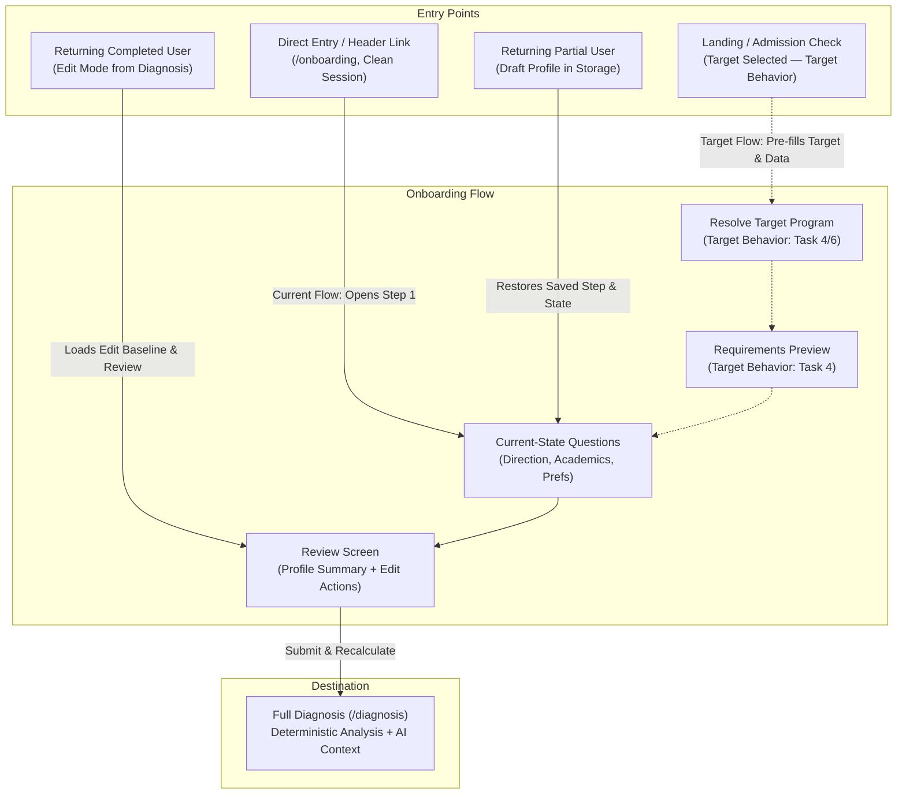

# Fortech Onboarding Specification — Hackathon Release

## 0. Document Authority & System Architecture

### 0.1 Source of Truth Hierarchy
This specification defines the onboarding experience for Fortech for the hackathon release. It is governed strictly by the repository rules and architectural guardrails defined in:
1. `AGENTS.md` (Git workflow, deterministic vs. AI ownership, student safety, scoring rules, non-manipulation);
2. `docs/FORTECH_MASTER_TZ.md` (Master product technical specification, P0 requirements, data models, trust model);
3. `docs/IMPLEMENTATION_PLAN.md` (Execution order, phase gates, task boundaries).

If any question or ambiguity arises, this document derives its authority directly from `docs/FORTECH_MASTER_TZ.md` and the existing codebase. No coding agent or developer shall invent new product requirements, scoring coefficients, external dependencies, or admission rules outside this specification.

### 0.2 The Core Product Loop
Onboarding serves as the gateway into Fortech's core product loop:

$$\text{Dream} \longrightarrow \text{Requirements} \longrightarrow \text{Current State} \longrightarrow \text{Gap} \longrightarrow \text{Plan} \longrightarrow \text{Progress} \longrightarrow \text{Recalculation}$$

The onboarding flow avoids arbitrary questionnaire hurdles. Instead, it maintains a transparent, student-centered structure:
1. **Dream (Goal)**: The student chooses the target university and degree program they want to pursue.
2. **Requirements**: Fortech presents the verified admission requirements and published criteria for that chosen program before asking for academic scores.
3. **Current State**: The student supplies their current study stage, available scores, language preferences, activities, and budget. Unanswered fields remain unknown.
4. **Gap**: The review screen presents a transparent, evidence-based gap comparison between target requirements and current profile values.
5. **Plan**: On submission, the student navigates to `/diagnosis`, which computes deterministic eligibility, strengths, gaps, missing information, and primes the roadmap.

### 0.3 Core Product Principles
- **Show, don't tell**: Demonstrate product capabilities through verified program facts and deterministic calculations rather than generic marketing claims.
- **Goal-first, not form-first**: Anchor the experience to a concrete goal (*"Where do you want to get in?"*) rather than opening with abstract inputs like GPA.
- **Facts first, AI second**: Admission requirements, eligibility states, fit scores, and deadlines are computed deterministically from structured verified records. AI serves solely to explain, contextualize, and summarize. AI never calculates eligibility, fit scores, or admissions facts.
- **Honest uncertainty**: Unknown data remains unknown (`null`). Unanswered fields or unverified program requirements must never be treated as failure or negative score penalties.
- **Student safety & dignity**: The target demographic includes school-age adolescents (Grades 10–12). The interface strictly prohibits fear-based language, artificial rejection warnings, or FOMO-driven urgency. Urgency originates solely from published calendar deadlines and verified prerequisite requirements.

---

## 1. Current Behavior vs Target Behavior

This section strictly distinguishes behavior provably implemented in the current repository from target behavior defined in the Master TZ and Implementation Plan for subsequent tasks, as well as out-of-scope concepts.

### 1.1 Behavior Already Implemented Today
The following features and contracts are implemented and tested on `main`:
- **Four-Step Onboarding Form (`components/journey/onboarding-form.tsx`)**:
  - Step 1 (Direction): `currentStudyStage` (Required), `targetDegree` (Required), `intendedField` (Required).
  - Step 2 (Academics): `gpa` (Optional), `ieltsScore` (Optional), `satScore` (Optional), `activitiesAndAchievements` (Optional textarea for contextual achievements).
  - Step 3 (Preferences): `preferredCountries` (Optional multi-select), `preferredLanguage` (Optional select dropdown), `annualBudget` (Optional number) with `budgetCurrency` (Select dropdown), `targetIntake` (Required select dropdown).
  - Step 4 (Review): Form review sections (`Goal`, `Academics`, `Preferences`), inline edit actions returning to earlier steps, missing intake notification, trust explanation card, and `"Analyze my profile"` submit action.
- **Validation Rules (`lib/onboarding.ts`)**:
  - `currentStudyStage`: Required on Step 1. Valid options: `"Grade 10"`, `"Grade 11"`, `"Grade 12"`, `"Undergraduate student"`, `"Graduate"`.
  - `targetDegree`: Required on Step 1. Must strictly equal `"Bachelor"`.
  - `intendedField`: Required on Step 1. Must equal `"Computer Science"` or `"Business"`.
  - `gpa`: Optional. If entered, must be in range `[0, 4]`. Step: `0.01`.
  - `ieltsScore`: Optional. If entered, must be in range `[0, 9]`. Step: `0.5`.
  - `satScore`: Optional. If entered, must be in range `[400, 1600]`. Step: `10`.
  - `activitiesAndAchievements`: Optional string (`activitiesAndAchievements?: string | null`). Does not trigger validation errors when blank or populated.
  - `annualBudget`: Optional. If entered, must be $> 0$. Step: `500`.
  - `targetIntake`: Required on Step 3 and Step 4. Valid options: `"Fall 2027"`, `"Spring 2028"`, `"Fall 2028"`.
- **Language of Instruction**:
  - `UniversityProgram.languageOfInstruction` typed as `string | null`.
  - `StudentProfile.preferredLanguage` typed as `string | null`.
  - Selectable languages in `onboarding-form.tsx` are derived dynamically from verified non-null `languageOfInstruction` values in `data/programs.ts`. In the current 18-program dataset, this resolves strictly to `["English"]`, plus `"No preference"` (`null` / empty string).
  - `preferredLanguage` has **zero weight** in `lib/admissions/scoring.ts` and does **not** alter numeric `fitScore` or `dataCoverage`.
  - `preferredLanguage` has **no effect** on deterministic eligibility in `lib/admissions/eligibility.ts`.
  - Surfaced as explanatory context evidence in `lib/admissions/presentation.ts` (`Match`, `Action needed`, `Needs verification`, `Not required`) and `lib/admissions/recommend.ts`.
- **Activities and Achievements Context**:
  - `StudentProfile.activitiesAndAchievements?: string | null` in `types/admissions.ts`.
  - Collected via multiline textarea on Step 2 (Academics) with helper note: *"This provides context for application planning and materials. It does not affect deterministic matching."*
  - Displayed on Step 4 Review under Academics as `{profile.activitiesAndAchievements?.trim() || "Not provided"}`.
  - Surfaced in `lib/admissions/diagnosis.ts`: If non-empty, adds `"Activities and achievements are available for application planning"` to `strengths`. If empty, no strength is added and no gap or missing item is generated.
  - Surfaced in `lib/admissions/roadmap.ts`: If non-empty, enriches the description of the `prepare-documents` task with contextual guidance; does not add or remove tasks.
  - Has **zero weight** in `lib/admissions/scoring.ts` and **no effect** on eligibility in `lib/admissions/eligibility.ts`.
  - Persisted in profile storage with backward compatibility for legacy records.
- **Deterministic Scoring & Eligibility**:
  - `lib/admissions/scoring.ts` computes `fitScore` (0–100) and `dataCoverage` across 6 weighted components:
    - `fieldFit`: 25
    - `academicFit`: 20
    - `budgetFit`: 20
    - `languageFit` (IELTS): 15
    - `countryPreference`: 10
    - `timelineFit`: 10
    - Total: 100 points maximum.
  - `preferredLanguage`, `currentStudyStage`, and `activitiesAndAchievements` have 0 scoring weight.
  - `lib/admissions/eligibility.ts` evaluates GPA, IELTS, and SAT against published program requirements to produce: `eligible_now`, `with_actions`, `not_eligible`, or `requires_verification`.
- **Current Onboarding Storage & Sync**:
  - Local browser persistence uses `localStorage`:
    - `admission-journey:v1:profile` (`StoredProfile`)
    - `admission-journey:v1:edit-baseline` (Baseline snapshot when editing)
    - `admission-journey:v1:change-impact` (Computed `ChangeImpact` diff)
  - `useClientReady()` delays mounting until client storage is ready.
  - Supabase synchronization (`lib/supabase/sync.ts`): Conflict resolution follows `chooseNewer(local, remote)` where the **newer `updatedAt` wins**.
  - Note: `admission-journey:v1:selected-program` exists in `lib/storage/selection.ts` for Program Detail and Roadmap views, but is **not** currently read or written by the onboarding form.
- **Post-Onboarding Destination**:
  - Submitting Step 4 navigates directly to `/diagnosis`.

### 1.2 Behavior Required by Master TZ but Not Yet Implemented
The following features are defined in `docs/FORTECH_MASTER_TZ.md` and scheduled for subsequent tasks in `docs/IMPLEMENTATION_PLAN.md`:
- **Task 4 (`feature/goal-first-target`)**:
  - Goal-first target entry foundation: User chooses a target university and program (`[Program] @ [University]`) from verified catalog data at the beginning of the flow.
  - Requirements-first preview: Surfacing verified program criteria (academics, IELTS, SAT, instruction language, application documents, deadline, tuition) before asking for personal profile metrics.
  - Storing the selected target program during onboarding.
- **Task 5 (`feature/instant-diagnosis`)**:
  - Minimal current-state inputs on the Landing page.
  - Target vs. Current State requirement comparison (Metric | Requirement | Current | Status).
  - Instant diagnosis result before signup/registration with 3–5 next actions.
- **Task 6 (`feature/onboarding-prefill`)**:
  - State transfer into onboarding: Pre-filling the selected target program and any profile metrics already supplied during the instant check so questions are not asked twice.
  - Preserving backward compatibility for sessions starting directly at `/onboarding`.

### 1.3 Optional / Future Ideas that Are NOT Current Requirements
The following items are explicitly **out of scope** and are not requirements for the hackathon release:
- **Climate / Environment Questions**: Excluded by Master TZ Section 4 (P0.4) due to lack of verified admissions datasets.
- **Automated Currency Conversion**: Excluded; budgets are compared only when published in the same currency.
- **Conversational AI Chatbots**: Excluded by Master TZ Section 6 (P2); AI remains an explanation layer for structured data.
- **Social / Competitive Features**: Excluded by Master TZ Section 6 (P2); no public student profiles, friend systems, rankings, or leaderboards.
- **Predictive Admission Chances**: Excluded; Fit Score measures profile alignment, never admission probability.

---

## 2. Entry States & Journey Architecture

The onboarding experience accounts for four entry states across current and planned target flows.



### 2.1 State A: User Arrives with a Selected Target (Target Behavior — Tasks 4 & 6)
- **Context**: A visitor interacts with the Landing Page Goal-first hero or Instant Check widget and selects a specific verified program (e.g. `aitu-computer-science`).
- **Target Flow Hand-off**:
  - The chosen target program is carried into onboarding.
  - Preliminary inputs (such as study stage, GPA, or IELTS) are pre-filled.
  - The flow presents the verified requirements for that target program before prompting for missing fields.

### 2.2 State B: Direct Entry at `/onboarding` Without a Target (Current Implementation)
- **Context**: User opens `/onboarding` directly with clean browser storage.
- **Current Flow Hand-off**:
  - `loadStoredProfile()` returns `null`.
- **Current User Experience**:
  - Opens on Step 1: Direction.
  - Prompts for `currentStudyStage`, `targetDegree` (`"Bachelor"`), and `intendedField` (`"Computer Science"` or `"Business"`).

### 2.3 State C: Returning User with Partial Profile (Current Implementation)
- **Context**: User returns to `/onboarding` after completing part of the form in an earlier session.
- **Current Flow Hand-off**:
  - `loadStoredProfile()` returns a `StoredProfile` with `completed === false` and `step` $\in \{1, 2, 3\}$.
- **Current User Experience**:
  - `useClientReady()` delays rendering until client storage is loaded.
  - Form restores the user's active step and all previously saved field values.

### 2.4 State D: Returning User with Completed Profile in Edit Mode (Current Implementation)
- **Context**: An existing user clicks "Edit admission profile" from `/diagnosis`.
- **Current Flow Hand-off**:
  - `loadStoredProfile()` returns `StoredProfile` with `completed === true`.
  - `saveEditBaseline(initial.profile)` takes a snapshot in `admission-journey:v1:edit-baseline`.
- **Current User Experience**:
  - User can edit fields across steps.
  - Upon submitting Step 4, `buildChangeImpact()` calculates metric changes and program eligibility transitions.
  - The diff is saved to `admission-journey:v1:change-impact`, and the user is routed to `/diagnosis` with Change Impact feedback.

---

## 3. Goal-First Behavior & Target Entity

### 3.1 "Dream First" Entry (Target Behavior — Task 4)
In accordance with Master TZ Section 3.2, the onboarding journey will anchor to a concrete goal:
> *"Where do you want to get in?"*

Rather than opening with grades, the target interaction asks:
1. **Intended Study Field**: Academic area (`"Computer Science"` or `"Business"`).
2. **Target University & Program**: A specific offering from Fortech's verified catalog (e.g. *Computer Science @ Astana IT University* or *Software Systems Engineering @ LUT University*).
3. **Target Intake**: Application timeline (`"Fall 2027"`, `"Spring 2028"`, `"Fall 2028"`).

### 3.2 Target University & Program Selection
- **Catalog Grounding**: Selection options are drawn strictly from the verified `programs` dataset in `data/programs.ts`. Free-text entry of unverified institutions is not permitted.
- **Scope**: Current catalog covers verified Bachelor programs in Computer Science and Business disciplines across Finland, Germany, Kazakhstan, and Poland.

### 3.3 Target Intake & Degree Constraints
- **`targetDegree`**:
  - `StudentProfile.targetDegree` is **not** inferred or copied from `program.degreeLevel`.
  - In the current repo contract, `targetDegree` is selected by the student and validated to strictly equal `"Bachelor"`.
- **`intendedField`**:
  - Selected by the student on Step 1 (`"Computer Science"` or `"Business"`).
- **`targetIntake`**:
  - Selected by the student (`"Fall 2027"`, `"Spring 2028"`, or `"Fall 2028"`).

### 3.4 Target Program Storage
- In the current implementation, `onboarding-form.tsx` does **not** persist a selected target program.
- Task 4 will introduce the appropriate target selection persistence mechanism, linking the chosen program into downstream diagnosis and roadmap views.

### 3.5 No Automatic Side Effects on `preferredCountries`
- Selecting a target university, program, or country must **NOT** automatically populate or modify `preferredCountries`.
- `preferredCountries` remains controlled exclusively by student input via the country selection checkboxes in Step 3.

---

## 4. Requirements-First Screen

### 4.1 Cognitive Model: Requirements Before Questions (Target Behavior — Task 4)
Master TZ Section 4 (P0.6) specifies that verified program requirements should be displayed **before** asking for detailed personal academic metrics.

**Rationale**:
- Providing a GPA or test score in isolation lacks clear motivation.
- Showing requirements first provides immediate context:
  > *"Astana IT University requires an academic UNT score (minimum 70) and a high school diploma. Now, let's see where you stand today."*
- Every subsequent input field has an immediate, student-understood purpose.

### 4.2 Displayed Program Requirements Matrix
When a target program is loaded, the following verified facts from `data/programs.ts` are presented:

| Requirement Category | Program Data Field | Displayed Information | Status Badge |
| :--- | :--- | :--- | :--- |
| **Academic Baseline** | `program.academicRequirement` | Requirement label (e.g. "UNT"), minimum score, or qualification notes. | `Verified Requirement` or `Qualification-specific` |
| **Language of Instruction** | `program.languageOfInstruction` | Teaching language (e.g. "English"). | `Verified` or `Needs verification` (`null`) |
| **English Proficiency** | `program.ieltsRequirement` | Minimum IELTS score (e.g. "6.5 minimum") or whether English proof is required. | `Verified Requirement` or `Not required` or `Needs verification` |
| **Standardized Tests** | `program.satRequirement` | Minimum SAT score or explicit exemption status. | `Verified Requirement` or `Not required` or `Needs verification` |
| **Required Documents** | `program.applicationDocuments` | Whether motivation letter or recommendation letters are officially required. | `Verified Requirement` or `Needs verification` |
| **Application Deadline** | `program.deadline` | Published application deadline date. | `Verified Deadline` or `Needs verification` |
| **Tuition Baseline** | `program.tuition`, `tuitionCurrency` | Published tuition fee per year or semester. | `Published Fee` or `Needs verification` |

### 4.3 Verified vs. Unknown Status Taxonomy
Requirement states use neutral, evidence-based badges:
- **Verified Requirement**: Fact verified from official university publication with source link.
- **Needs Verification**: Requirement exists, but exact score minimums or international conversions are qualification-specific, or data is pending verification.
- **Not Required**: Program officially confirms the metric is not mandatory for admission.
- **Unknown / Unverified**: Information not currently verified in the dataset.

### 4.4 Official Provenance & Source Attribution
- Every requirement card includes an official source attribution:
  > *Source: Bachelor admissions · astanait.edu.kz*
- Clicking opens the official university URL in a new tab (`target="_blank" rel="noopener noreferrer"`).
- If a requirement is not verified in `data/programs.ts`, it is marked as `Needs verification` or left blank. No requirements may be hallucinated or generated by AI.

---

## 5. Current-State Questionnaire Specification

### 5.1 Questionnaire Principles
1. **Mandatory Fields**: Only fields strictly required to form a valid directional match are mandatory (`currentStudyStage`, `targetDegree`, `intendedField`, `targetIntake`).
2. **Optional Academic Scores**: Academic GPA, IELTS, SAT, and tuition budget are optional.
3. **Blank Stays Unknown**: Blank numeric fields evaluate to `null`. They are never converted into zeros, failing grades, or penalties.
4. **Context Fields Do Not Affect Scores**: Extracurricular free text and study stage are qualitative context and do not alter deterministic fit scores.

### 5.2 Comprehensive Field-by-Field Matrix

| Field Name | Type | Mandatory? | Form Step | Input Control | Valid Options / Range | Scoring Impact (Fit Score) | Eligibility Impact |
| :--- | :--- | :--- | :--- | :--- | :--- | :--- | :--- |
| `currentStudyStage` | `string \| null` | **Required** | Step 1 | Choice Cards (Radio) | `"Grade 10"`, `"Grade 11"`, `"Grade 12"`, `"Undergraduate student"`, `"Graduate"` | **0 weight** in `scoring.ts`. | **None** (Not in `eligibility.ts`). |
| `targetDegree` | `string \| null` | **Required** | Step 1 | Choice Card (Radio) | Must strictly equal `"Bachelor"` | Filters eligible catalog. | Program eligibility gate. |
| `intendedField` | `string \| null` | **Required** | Step 1 | Choice Cards (Radio) | `"Computer Science"`, `"Business"` | **25% weight** (`fieldFit` in `scoring.ts`). | Evaluated against program field. |
| `gpa` | `number \| null` | Optional | Step 2 | Numeric Input | Decimal `0.00` – `4.00`, step `0.01` | **20% weight** (`academicFit` in `scoring.ts`). | Gate if minimum required; blank = `requires_verification`. |
| `ieltsScore` | `number \| null` | Optional | Step 2 | Numeric Input | Decimal `0.0` – `9.0`, step `0.5` | **15% weight** (`languageFit` in `scoring.ts`). | Improvable gap if below min; blank = `requires_verification`. |
| `satScore` | `number \| null` | Optional | Step 2 | Numeric Input | Integer `400` – `1600`, step `10` | Improvable gap if required; neutral if not required. | Improvable gap if required and below minimum. |
| `activitiesAndAchievements` | `string \| null` | Optional | Step 2 | Multiline Textarea | Free-text string | **0 weight** in `scoring.ts`. | **None** (Not in `eligibility.ts`). Diagnosis/Roadmap context. |
| `preferredCountries` | `string[]` | Optional | Step 3 | Multi-select Checkboxes | Countries in catalog: `"Finland"`, `"Germany"`, `"Kazakhstan"`, `"Poland"` | **10% weight** (`countryPreference`). Empty = full weight. | **None** (Not in `eligibility.ts`). |
| `preferredLanguage` | `string \| null` | Optional | Step 3 | Select Dropdown | Verified non-null program values: `"English"`, plus `"No preference"` (`null`) | **0 weight** in `scoring.ts`. | **None** (Not in `eligibility.ts`). Explanatory context only. |
| `annualBudget` | `number \| null` | Optional | Step 3 | Numeric Input | Integer $> 0$, step `500` | **20% weight** (`budgetFit`) only if currencies match. | **None** (Not in `eligibility.ts`). |
| `budgetCurrency` | `string \| null` | Optional (Required if budget set) | Step 3 | Select Dropdown | Currencies in catalog: `"EUR"`, `"KZT"`, `"PLN"`, `"USD"` | Required to compute `budgetFit`. Differing currency = null fit. | **None** (Not in `eligibility.ts`). |
| `targetIntake` | `string \| null` | **Required** | Step 3, 4 | Select Dropdown | `"Fall 2027"`, `"Spring 2028"`, `"Fall 2028"` | **10% weight** (`timelineFit` in `scoring.ts`). | **None** (Not in `eligibility.ts`). |

---

### 5.3 Detailed Field Specifications

#### 1. `currentStudyStage`
- **Label**: Current study stage
- **Input Type**: Choice Cards (Radio group)
- **Options**:
  - Primary: `Grade 10`, `Grade 11`, `Grade 12`
  - Secondary (expandable details): `Undergraduate student`, `Graduate`
- **Mandatory**: **Yes** (enforced on Step 1: `if (!profile.currentStudyStage) errors.currentStudyStage = "Choose your current study stage."`).
- **Helper Copy**: *"Helps tailor your guidance. It does not change deterministic matching."*
- **Scoring & Eligibility Impact**: Strictly 0 weight. Does not affect Fit Score or eligibility.
- **Display**: Displayed in Diagnosis profile summary under Goal as `Current stage: [Value]`.

#### 2. `targetDegree`
- **Label**: Your target
- **Input Type**: Choice Card (Radio)
- **Options**: `Bachelor` (Badged: *"Supported in this version"*)
- **Mandatory**: **Yes** (enforced on Step 1: `if (profile.targetDegree !== "Bachelor") errors.targetDegree = "Choose the supported Bachelor journey."`).
- **Inference Rule**: `targetDegree` must **NOT** be inferred or copied from `program.degreeLevel`. Current `StudentProfile.targetDegree` remains `"Bachelor"` as selected by the student.

#### 3. `intendedField`
- **Label**: Intended field
- **Input Type**: Choice Cards (Radio group with descriptions)
- **Options**:
  - `Computer Science` — *"Software, data, IT and digital systems"*
  - `Business` — *"Management, finance, analytics and business"*
- **Mandatory**: **Yes** (enforced on Step 1: `if (!profile.intendedField) errors.intendedField = "Choose the field you want to study."`).
- **Scoring Impact**: 25% weight (`fieldFit` in `lib/admissions/scoring.ts`). Evaluated via `fieldsMatch()` against `program.field` using `relatedFieldGroups`. Match = 25 points; mismatch = 0 points.

#### 4. `gpa` (Grade Point Average)
- **Label**: GPA (Optional)
- **Input Type**: Decimal number input (`inputMode="decimal"`)
- **Validation**: If entered, must satisfy `0.0 <= gpa <= 4.0`. Step: `0.01`. Error: *"Enter a GPA between 0 and 4."*
- **Helper Copy**: *"Add your GPA on the supported 0–4 scale, if you know it."*
- **Scoring Impact**: 20% weight (`academicFit` in `lib/admissions/scoring.ts`). Evaluated proportionally against `program.academicRequirement.minimumScore`.
- **Eligibility Impact**: If program has a mandatory minimum academic score and `gpa < minimumScore`, eligibility resolves to `not_eligible`. If left blank and requirement is mandatory, resolves to `requires_verification`.
- **Blank Behavior**: Blank evaluates to `null`. Never scored as 0 or failure.

#### 5. `ieltsScore`
- **Label**: IELTS (Optional)
- **Input Type**: Decimal number input (`inputMode="decimal"`)
- **Validation**: If entered, must satisfy `0.0 <= ieltsScore <= 9.0`. Step: `0.5`. Error: *"Enter an IELTS score between 0 and 9."*
- **Helper Copy**: *"Haven’t taken IELTS yet? Leave this blank; the requirement stays unknown until program facts are checked."*
- **Scoring Impact**: 15% weight (`languageFit` in `lib/admissions/scoring.ts`). Proportional score against `program.ieltsRequirement.minimumScore`.
- **Eligibility Impact**: If `ieltsScore < minimumScore` on a required IELTS requirement, flags an improvable gap (`with_actions`). If left blank and required, resolves to `requires_verification`.
- **Blank Behavior**: Blank evaluates to `null`.

#### 6. `satScore`
- **Label**: SAT (Optional)
- **Input Type**: Number input (`inputMode="numeric"`)
- **Validation**: If entered, must satisfy `400 <= satScore <= 1600`. Step: `10`. Error: *"Enter an SAT score between 400 and 1600."*
- **Helper Copy**: *"Leave blank if not taken. Missing SAT is not treated as a failed score."*
- **Scoring & Eligibility Impact**: If required and below minimum, flags an improvable gap (`with_actions`). If `satRequirement.isRequired === false`, missing SAT has no negative effect.
- **Blank Behavior**: Blank evaluates to `null`.

#### 7. `activitiesAndAchievements`
- **Label**: Olympiads, projects, volunteering, or other achievements (Optional)
- **Input Type**: Multiline textarea (Step 2 — Academics)
- **Mandatory**: Optional (`activitiesAndAchievements?: string | null`).
- **Helper Copy**: *"This provides context for application planning and materials. It does not affect deterministic matching."*
- **Scoring & Eligibility Impact**: **Strictly 0 weight** in `lib/admissions/scoring.ts` and `lib/admissions/eligibility.ts`.
- **Diagnosis Integration**: If non-empty, surfaces in `diagnosis.strengths` as *"Activities and achievements are available for application planning"*. If blank, no strength is added and no warning or gap is created.
- **Roadmap Integration**: Enriches the description of the `prepare-documents` task with contextual guidance: *"Use the activities and achievements you provided as relevant examples only where the program's confirmed application materials ask for them."*
- **Review Display**: Displayed in Step 4 Review under Academics as `{profile.activitiesAndAchievements?.trim() || "Not provided"}`.

#### 8. `preferredCountries`
- **Label**: Preferred countries (Optional)
- **Input Type**: Multi-select checkboxes
- **Options**: Dynamically sorted from distinct non-null `country` values in `data/programs.ts` (`"Finland"`, `"Germany"`, `"Kazakhstan"`, `"Poland"`).
- **Helper Copy**: *"Countries currently covered by our verified program set. Select every location you would seriously consider."*
- **Scoring Impact**: 10% weight (`countryPreference` in `lib/admissions/scoring.ts`). If empty array, awards full 10 points (no geographic filter). If non-empty, awards 10 points if `program.country` matches any selected country; 0 if not.
- **Automatic Population Prohibition**: Selecting a target university, program, or country must **NOT** automatically populate `preferredCountries`. `preferredCountries` is modified only when the student explicitly checks or unchecks country options.

#### 9. `preferredLanguage`
- **Label**: What language would you prefer to study in? (Optional)
- **Input Type**: Select dropdown (Step 3 — Preferences)
- **Options**: Derived **only** from verified non-null `UniversityProgram.languageOfInstruction` values in the current dataset, plus `"No preference"`:
  - Current dataset option: `"English"`
  - Default / unset option: `"No preference"` (`null` / empty string)
- **Helper Copy**: *"Choose from languages verified in the current program set. Leave blank if you have no preference."*
- **Scoring Impact**: **Strictly 0 weight**. Does **NOT** affect numeric Fit Score in `lib/admissions/scoring.ts`.
- **Eligibility Impact**: Does **NOT** affect deterministic eligibility in `lib/admissions/eligibility.ts`.
- **Explanatory Context Role**:
  - In `lib/admissions/presentation.ts`, language alignment is presented as an explanatory criterion:
    - If `preferredLanguage === null`: status `"Not required"`, detail *"No language preference is set, so this does not affect your profile alignment."*
    - If `program.languageOfInstruction === null`: status `"Needs verification"`, detail *"The current verified program data does not state the teaching language."*
    - If normalized values match: status `"Match"`, detail *"This program is taught in your preferred language."*
    - If normalized values differ: status `"Action needed"`, detail *"The program language differs from your preference. Confirm that it works for you."*
  - In `lib/admissions/recommend.ts`: surfaced in recommendation reasons (`"Taught in your preferred language"`) or gaps (`"Program is taught in X; your preference is Y"`).

#### 10. `annualBudget` & `budgetCurrency`
- **Label**: Annual tuition budget (Optional)
- **Input Type**: Dual input — Currency select dropdown + number input
- **Currencies**: Dynamically sorted from distinct non-null `tuitionCurrency` values in `data/programs.ts` (`"EUR"`, `"KZT"`, `"PLN"`, `"USD"`).
- **Validation**: If `annualBudget` is provided, must be $> 0$. Step: `500`. Error: *"Enter a tuition budget greater than 0, or leave it blank."*
- **Helper Copy**: *"Tuition only · living costs are not included."*
- **Comparison Rule**: *"We compare budget only when program tuition is published in the same currency. We do not guess exchange rates."*
- **Scoring Impact**: 20% weight (`budgetFit` in `lib/admissions/scoring.ts`). Calculated via `Math.min(1, profile.annualBudget / program.tuition) * 20` only when `profile.budgetCurrency === program.tuitionCurrency` and `tuitionPeriod === "year"`. If currencies differ, `budgetFit` is `null` and excluded from scoring coverage.

#### 11. `targetIntake`
- **Label**: Target intake
- **Input Type**: Select dropdown
- **Options**: `"Fall 2027"`, `"Spring 2028"`, `"Fall 2028"`
- **Mandatory**: **Yes** (enforced on Step 3 and Step 4: `if (!profile.targetIntake) errors.targetIntake = "Choose a target intake."`).
- **Helper Copy**: *"Choose the existing intake that best matches your application timeline."*
- **Scoring Impact**: 10% weight (`timelineFit` in `lib/admissions/scoring.ts`). Awards 10 points if intake year matches program deadline year; 0 if they differ; null if year cannot be extracted.

---

### 5.4 Step Sequence Architecture

```
[ Step 1: Direction ] ──▶ [ Step 2: Academics & Activities ] ──▶ [ Step 3: Preferences ] ──▶ [ Step 4: Review ]
```

- **Step 1: Direction**
  - Set `targetDegree` (`"Bachelor"`).
  - Set `intendedField` (`"Computer Science"` or `"Business"`).
  - Set `currentStudyStage` (`"Grade 10"`, `"Grade 11"`, `"Grade 12"`, `"Undergraduate student"`, or `"Graduate"`).
- **Step 2: Academics & Activities**
  - Banner: *"Blank means unknown. We never turn a missing score into a pass or a fail."*
  - Optional academic inputs: `gpa`, `ieltsScore`, `satScore`.
  - Optional context textarea: `activitiesAndAchievements`.
- **Step 3: Preferences**
  - `preferredCountries` (checkboxes).
  - `preferredLanguage` (select dropdown from verified program languages).
  - `annualBudget` and `budgetCurrency`.
  - `targetIntake` (select dropdown).
- **Step 4: Review & Admission Profile**
  - Grouped review cards: Goal, Academics (including activities), Preferences.
  - Edit button per section allowing users to return directly to that step.
  - Trust notice explaining deterministic matching and AI boundaries.
  - Submit button: *"Analyze my profile"*.

---

## 6. State Transfer, Persistence & Synchronization

### 6.1 State Transfer (Target Behavior — Task 6)
To satisfy Master TZ Section 4 (P0.9):
- Any input entered during pre-onboarding (such as on the Landing page instant check) will be carried into onboarding.
- Pre-supplied values will populate automatically.
- Users will not be asked to re-enter data that has already been provided.

### 6.2 Current Browser Storage Contracts
Onboarding in the current codebase reads and writes state in browser `localStorage`:
- **`admission-journey:v1:profile`**:
  ```ts
  export type StoredProfile = {
    version: 1;
    profile: StudentProfile;
    step: number;        // Active step (1..4)
    completed: boolean;   // True after Step 4 submission
    updatedAt: string;   // ISO-8601 timestamp
  };
  ```
- **`admission-journey:v1:edit-baseline`**: Stores `StudentProfile` snapshot when editing an already completed profile.
- **`admission-journey:v1:change-impact`**: Stores the computed `ChangeImpact` diff after updating a profile.

*Note on target persistence*: `SELECTED_PROGRAM_STORAGE_KEY` (`admission-journey:v1:selected-program`) exists in `lib/storage/selection.ts` for Program Detail and Roadmap views, but is not currently read or written by the onboarding form. Target persistence in onboarding will be integrated under Task 4 / Task 6.

### 6.3 Hydration & Reactive State Management
- Storage is loaded client-side via `useClientReady()`, rendering a placeholder (*"Restoring your saved progress…"*) until mounted to avoid SSR hydration mismatches.
- Field modifications update local state and call `saveStoredProfile(profile, step, completed)`.
- Page refreshes restore the current step and input values from `localStorage`.

### 6.4 Edit Baseline & Change Impact Protocol
When a returning user with a completed profile (`completed === true`) modifies profile values:
1. `saveEditBaseline(initial.profile)` stores the baseline snapshot.
2. Upon submitting Step 4, `buildChangeImpact(previousProfile, profile, previousMatches, newMatches)` compares:
   - Metric changes (e.g. `IELTS 6.0 → 7.0`);
   - Program eligibility transitions and gap changes;
   - Human-readable summary rows.
3. If changes exist, `saveRecentChangeImpact(impact)` persists the diff.
4. `/diagnosis` renders the Change Impact banner explaining the consequences of the update.

### 6.5 Persistence Sync Semantics: Newer `updatedAt` Wins
When Supabase is configured, background persistence synchronization in `lib/supabase/sync.ts` follows deterministic timestamp-based conflict resolution:
```ts
export function chooseNewer<T extends { updatedAt: string }>(local: T | null, remote: T | null) {
  if (!local) return remote ? { source: "remote" as const, value: remote } : null;
  if (!remote) return { source: "local" as const, value: local };
  return Date.parse(remote.updatedAt) > Date.parse(local.updatedAt)
    ? { source: "remote" as const, value: remote }
    : { source: "local" as const, value: local };
}
```
- **Conflict Resolution Rule**: **Newer `updatedAt` wins**.
- If `remote.updatedAt > local.updatedAt`, the remote record updates local storage.
- If `local.updatedAt >= remote.updatedAt`, the local record updates remote storage.
- Local state is not unconditionally authoritative; the latest valid update takes precedence.
- If cloud synchronization is unconfigured or unreachable, onboarding updates continue to be saved to `localStorage`.

---

## 7. Conditional Logic & Data Integrity

### 7.1 Non-Intrusive Defaults & Validations
- `intendedField` must be selected by the user (`"Computer Science"` or `"Business"`).
- `targetDegree` must be selected by the user and must equal `"Bachelor"`.
- Missing required fields block progression with specific inline error copy.

### 7.2 The Rule of Honest Uncertainty
In accordance with AGENTS.md Section 5:
- An unanswered numeric field (`gpa === null`, `ieltsScore === null`, `satScore === null`, `annualBudget === null`) is never treated as 0 or failing.
- In `lib/admissions/eligibility.ts`:
  - An unknown required criterion evaluates to `requires_verification`, **not** `not_eligible`.
- In `lib/admissions/scoring.ts`:
  - Unknown fields return `null` and are excluded from both earned points and data coverage weighting.

### 7.3 Separation of Concerns: Deterministic Logic vs. AI
- **Deterministic logic owns**:
  - Admissions requirements;
  - Eligibility rules (`eligible_now`, `with_actions`, `not_eligible`, `requires_verification`);
  - Scoring and fit calculation (`calculateFit`);
  - Deadlines and language alignment;
  - Gap and strength calculation;
  - Change impact diffing.
- **AI owns**:
  - Human-readable explanations of deterministic findings;
  - Summarization of priority next actions;
  - Contextual guidance.
- AI must never fabricate requirements, deadlines, test minimums, tuition, or acceptance chances. AI is not invoked on onboarding step transitions.

---

## 8. Review Screen & Gap Preview (Step 4)

### 8.1 Current Review Layout & Controls
Step 4 allows the student to review their profile before generating their full analysis:
1. **Title & Subtitle**: *"Your admission profile is ready"* — *"Review the information that will shape your deterministic analysis."*
2. **Review Sections with Edit Actions**:
   - **Goal**: Target degree, intended field, and current study stage. Includes `Edit` button targeting Step 1.
   - **Academics**: GPA, IELTS, SAT, and activities text. Includes `Edit` button targeting Step 2.
   - **Preferences**: Preferred countries, preferred language of instruction, annual tuition budget, and target intake. Includes `Edit` button targeting Step 3.
3. **Missing Intake Warning**: If `targetIntake` was cleared or unselected, an alert states: *"Add a target intake in Preferences before analysis."*
4. **How We'll Use This (Trust Notice)**:
   - Match profile against verified program data.
   - Keep unknown information unknown.
   - Separate profile fit from eligibility — Fit Score is not admission probability.
   - AI may explain results, but cannot change eligibility, Fit Score, or verified program facts.
5. **Footer Actions**:
   - `Back` button to return to Step 3.
   - Primary submit button: `Analyze my profile`.

### 8.2 Target vs. Current State Gap Comparison Matrix (Target Behavior — Tasks 5 & 6)
When a target program is selected in the goal-first flow, Step 4 will include a side-by-side gap comparison table:

| Metric | Target Requirement (Verified) | Current Input | Status |
| :--- | :--- | :--- | :--- |
| **Academic Standing** | Published program requirement | Student GPA (0–4 scale) | `Ready` / `Needs verification` |
| **English Proficiency** | Published IELTS minimum | Student IELTS score | `Ready` / `Action needed` / `Needs verification` |
| **Standardized Test** | Published SAT minimum or not required | Student SAT score | `Ready` / `Not required` / `Needs verification` |
| **Language of Instruction** | Published teaching language | Preferred language | `Match` / `Action needed` / `Needs verification` |
| **Annual Tuition** | Published tuition per year | Student budget | `Ready` / `Needs verification` |
| **Target Intake** | Application cycle deadline | Student target intake | `Ready` / `Action needed` |

---

## 9. Completion Behavior & Downstream Handoff

### 9.1 Primary Destination: `/diagnosis`
Upon clicking `"Analyze my profile"`:
1. `saveStoredProfile(profile, 4, true)` writes `completed: true` to `localStorage`.
2. Router navigates directly to `/diagnosis`.
3. `/diagnosis` presents:
   - Requirement coverage;
   - Strengths (`diagnosis.strengths`), including activities context when populated;
   - Gaps (`diagnosis.gaps`);
   - Unknown/verification items (`diagnosis.missingInformation`);
   - Next priority actions;
   - Contextual AI explanation.

### 9.2 Execution Handler Sequence on Submit
```ts
function submit(event: React.FormEvent<HTMLFormElement>) {
  event.preventDefault();
  if (!validStep(step, profile)) {
    setAttemptedStep(step);
    return;
  }

  setAttemptedStep(null);
  if (step < 4) {
    setStep((current) => current + 1);
    return;
  }

  setCompleted(true);
  const previousProfile = loadEditBaseline();
  if (previousProfile) {
    const impact = buildChangeImpact(
      previousProfile,
      profile,
      getPrimaryMatches(previousProfile),
      getPrimaryMatches(profile),
    );
    if (impact.programChanges.length > 0) saveRecentChangeImpact(impact);
    else clearRecentChangeImpact();
  } else {
    clearRecentChangeImpact();
  }
  clearEditBaseline();
  saveStoredProfile(profile, 4, true);
  router.push("/diagnosis");
}
```

### 9.3 Deterministic Outputs Computed
On `/diagnosis`:
- `diagnoseProfile(profile)` evaluates strengths, gaps, and missing items.
- `getPrimaryMatches(profile)` ranks programs based on `calculateFit()`.
- `evaluateEligibility(profile, program)` assigns eligibility status for matching programs.
- Roadmap tasks are generated via `generateRoadmap()`.

---

## 10. Mobile & Responsive UX (Implementation & Guidelines)

### 10.1 Observed Responsive Layout
In the current code:
- Desktop: Two-column layout with sticky left sidebar (`StepProgress` and `ProfilePreview`) and main form panel.
- Mobile ($< 1024\text{px}$): Single-column layout. Left sidebar is hidden via `lg:block`; sticky mobile progress card is rendered above the form panel.

### 10.2 Mobile Header & Progress Drawer
The mobile progress header provides:
- Step counter: `Step X of 4`.
- Step title.
- Step percentage (`Math.round((step / 4) * 100)%`).
- Visual 4-segment progress bar.
- Collapsible `<details>` drawer: *"Your profile so far · View summary"*, allowing students to inspect entered values on mobile without losing form position.

### 10.3 Form Controls & Virtual Keyboard Input Modes
- GPA and IELTS use `inputMode="decimal"` for numeric decimal entry.
- SAT and budget use `inputMode="numeric"` for integer entry.
- Choice cards and buttons use `min-h-12` or `min-h-11` sizing for comfortable touch interaction.

### 10.4 Non-Binding Mobile Recommendations
- Preserve card padding and typography scaling to avoid horizontal scrolling on small screens.
- Keep tap targets easy to interact with on mobile viewports.
- Maintain visual feedback on radio card selection.

---

## 11. Accessibility & Form Usability (Implementation & Guidelines)

### 11.1 Observed Semantic HTML Structure
In the current code:
- Form elements use `<form noValidate>` with semantic markup.
- Step progression is marked with `<nav aria-label="Onboarding progress">`.
- Radio card groups use `<fieldset>` and `<legend>`.
- Form inputs have associated `<label htmlFor="...">`.

### 11.2 Observed Form Associations & Error Feedback
- Inputs link helper copy and error strings via `aria-describedby`:
  ```html
  <input
    id="gpa"
    type="number"
    aria-describedby="gpa-help gpa-error"
    aria-invalid="true"
  />
  <p id="gpa-help">Add your GPA on the supported 0–4 scale, if you know it.</p>
  <p id="gpa-error" role="alert">Enter a GPA between 0 and 4.</p>
  ```
- Error messages use `role="alert"` for assistive announcements.
- Radio buttons use `className="sr-only"` wrapped inside clickable `<label>` containers with visible focus ring support.

### 11.3 Non-Binding Usability Recommendations
- Maintain logical DOM tab order across steps.
- Ensure text contrast remains clear against background card surfaces.
- Respect reduced-motion preferences when adding transitions or animations.

---

## 12. Loading, Error, and Recovery States

### 12.1 Client Hydration & Storage Loading
- `useClientReady()` delays rendering until client hydration finishes, rendering a placeholder (*"Restoring your saved progress…"*) to avoid mismatch warnings between server and client storage.

### 12.2 Form Validation & Inline Recovery
- `stepErrors(step, profile)` validates input values synchronously.
- If a required field is missing upon clicking `"Continue"`, inline error messages display, and step navigation is paused until corrected.

### 12.3 Corrupted Storage Fallback
- If `localStorage` holds malformed JSON or invalid schema structures:
  - `parseStoredProfileValue()` returns `null`.
  - The form safely falls back to `emptyProfile`.
  - The student can proceed with onboarding without application crashes.

### 12.4 Offline & Network Handling
- Local state updates and storage writes are executed synchronously on the client.
- If background Supabase synchronization is unconfigured or encounters network errors, local form progression and navigation to `/diagnosis` continue without disruption.

---

## 13. Acceptance Criteria & Test Matrix

### 13.1 User Journey Scenarios

#### Scenario 1: Clean First-Time Visitor
- **Given** clean browser storage.
- **When** the user loads `/onboarding`.
- **Then** Step 1 presents required study stage, target degree (`"Bachelor"`), and intended field choices.
- **When** Step 2 loads and user leaves GPA, IELTS, SAT, and activities blank.
- **Then** no validation errors are shown; blank fields remain `null`.
- **When** user completes Step 3 with a valid target intake and submits Step 4.
- **Then** `StoredProfile.completed` is set to `true`, and user is navigated to `/diagnosis`.

#### Scenario 2: Returning User with Draft
- **Given** an incomplete profile in `localStorage` at Step 2.
- **When** user navigates to `/onboarding`.
- **Then** the form restores Step 2 with all previously entered values.

#### Scenario 3: Returning Completed User Editing Profile
- **Given** a completed profile with `ieltsScore: 6.0`.
- **When** user visits `/onboarding`, edits IELTS to `7.0`, and submits Step 4.
- **Then** `saveEditBaseline` records the baseline, `buildChangeImpact` records the delta, and `/diagnosis` reflects the updated score with Change Impact context.

#### Scenario 4: Boundary Validation
- **Given** a user on Step 2 entering GPA `4.5` or IELTS `10.0`.
- **When** user clicks `"Continue"`.
- **Then** navigation is blocked and inline errors are displayed.

### 13.2 Automated Test Coverage Alignment
Onboarding contracts are verified by tests in `lib/onboarding.test.ts`:
- `stepErrors(1, profile)` verifies `currentStudyStage`, `targetDegree === "Bachelor"`, and `intendedField`.
- `stepErrors(2, profile)` verifies score ranges for `gpa`, `ieltsScore`, and `satScore`.
- `stepErrors(3, profile)` verifies `annualBudget > 0` and `targetIntake`.
- `stepErrors(4, profile)` verifies `targetIntake` presence before review submission.
- `activitiesAndAchievements` is tested as optional, non-scoring context.
- `preferredLanguage` is tested as optional, non-scoring context.

---

## 14. Explicit Non-Goals

The following items are explicitly **out of scope** for the onboarding implementation:
1. **AI Provider Alterations**: No changes to `/api/ai/...`, fallback logic, or provider routing.
2. **Social or Competitive Mechanics**: No peer comparison, public profiles, leaderboards, or follower feeds.
3. **Fear / Shame Mechanics**: No countdown urgency timers, rejection warnings, or manipulative microcopy.
4. **Climate / Environment Preferences**: No survey questions regarding weather or lifestyle.
5. **Arbitrary Fit Percentages**: No invented admission probabilities or acceptance odds.
6. **Design System Inventions**: No invented brand palettes or third-party studio font clones.
7. **Application Code Changes in This Branch**: This task is strictly documentation; application code changes will be implemented in dedicated feature branches according to `docs/IMPLEMENTATION_PLAN.md`.
