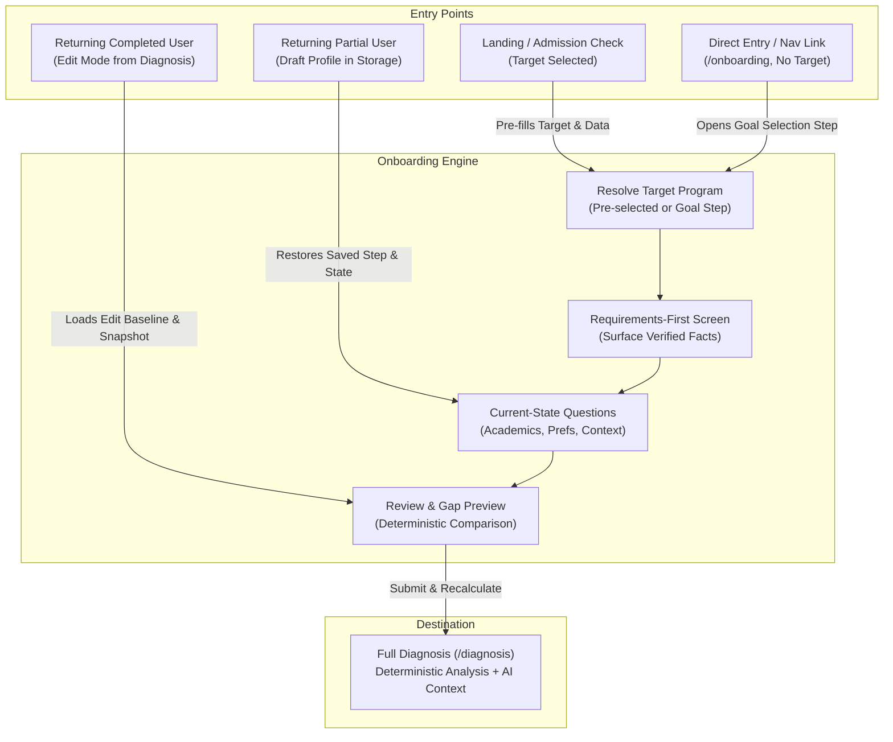

# Fortech Onboarding Specification — Hackathon Release

## 0. Document Authority & System Architecture

### 0.1 Source of Truth Hierarchy
This specification defines the complete target onboarding experience for the Fortech platform for the hackathon release. It is governed strictly by the repository rules and architectural guardrails defined in:
1. `AGENTS.md` (Git workflow, deterministic vs. AI ownership, student safety, scoring rules, non-manipulation);
2. `docs/FORTECH_MASTER_TZ.md` (Master product technical specification, P0 requirements, data models, trust model);
3. `docs/IMPLEMENTATION_PLAN.md` (Execution order, phase gates, task boundaries).

If any ambiguity arises during implementation, this document derives its authority directly from `docs/FORTECH_MASTER_TZ.md`. No coding agent or developer shall invent new product features, scoring algorithms, external dependencies, or admission rules outside this specification.

### 0.2 The Core Product Loop
Onboarding is the critical entry point into the Fortech core product loop:

$$\text{Dream} \longrightarrow \text{Requirements} \longrightarrow \text{Current State} \longrightarrow \text{Gap} \longrightarrow \text{Plan} \longrightarrow \text{Progress} \longrightarrow \text{Recalculation}$$

The student journey must never feel like an interrogation or a bureaucratic administrative form. Instead, the onboarding journey establishes an immediate feedback loop:
1. **Dream (Goal)**: The student declares the target university and degree program they aspire to join.
2. **Requirements**: Fortech surfaces the official, verified admission requirements and published criteria for that target before requesting profile details.
3. **Current State**: The student provides their current academic standing, test scores, study language, and preferences, answering only what is relevant and known.
4. **Gap**: The review screen presents a transparent, evidence-based gap matrix comparing the student's inputs against the target requirements without manufactured scores.
5. **Plan**: On completion, the student lands directly on `/diagnosis`, which computes deterministic strengths, gaps, missing data, and primes the roadmap.

### 0.3 Core Product Principles
- **Show, don't tell**: Demonstrate capability through real program facts and instant calculations rather than generic marketing copy.
- **Goal-first, not form-first**: Never open the onboarding experience with an abstract form field such as "Enter your GPA". Anchor every question to the chosen goal.
- **Facts first, AI second**: Admission requirements, eligibility statuses, fit scores, and deadlines are computed 100% deterministically from structured verified records. AI serves solely to explain, contextualize, and summarize.
- **Honest uncertainty**: Unknown data must remain unknown (`null`). Unanswered fields or unverified program requirements must never be treated as failure or negative points.
- **Student safety & dignity**: The target demographic includes school-age adolescents (Grades 10–12). The interface strictly prohibits fear-based language, artificial rejection warnings, or FOMO-driven urgency. Urgency originates solely from published calendar deadlines and verified prerequisite requirements.

---

## 1. Entry States & Journey Architecture

The onboarding experience accommodates four distinct entry states to ensure continuous user context and zero redundant inputs.



### 1.1 State A: User Arrives with a Selected Target (Pre-Onboarding Flow)
- **Source**: Visitor engaged with the Landing Page hero, Target Search, or Instant Admission Check widget (Task 4/5) and selected a specific program (e.g. `aitu-computer-science`).
- **State Hand-off**:
  - `selectedProgramId` is saved in `localStorage` under `admission-journey:v1:selected-program` (or passed via query parameter `?target=aitu-computer-science`).
  - Any pre-admission check inputs (e.g., `currentStudyStage`, preliminary `gpa` or `ieltsScore`) are stored in `admission-journey:v1:profile`.
- **User Experience**:
  - The student does **not** see an empty goal-selection step.
  - Step 1 immediately displays the **Requirements-First** view for their selected target, showing what that program requires.
  - Subsequent steps pre-populate any fields already collected; the user is only asked for remaining unknown information.

### 1.2 State B: User Arrives Directly Without a Target (Clean Entry)
- **Source**: User clicks "Start profile" from the main navigation header or visits `/onboarding` directly with no prior session state.
- **State Hand-off**:
  - `loadStoredProfile()` returns `null`.
  - `loadSelectedProgram()` returns `null`.
- **User Experience**:
  - Onboarding opens on **Step 1: Your Target Goal**.
  - The student selects their intended study field ("Computer Science" or "Business"), target degree ("Bachelor"), and selects their dream university and program from Fortech's verified catalog.
  - As soon as the program is selected, the **Requirements-First** panel reveals published admission criteria.

### 1.3 State C: Returning User with Partial Profile (Draft Recovery)
- **Source**: User closed the browser midway through onboarding and returns to `/onboarding`.
- **State Hand-off**:
  - `loadStoredProfile()` returns a valid `StoredProfile` with `completed === false` and `step` $\in \{1, 2, 3\}$.
- **User Experience**:
  - Onboarding immediately restores the user's progress using `useClientReady()`.
  - An unobtrusive restore indicator is displayed: *"Restored your saved draft from this browser."*
  - The student resumes on the step where they left off with all previously selected options and inputs fully populated.

### 1.4 State D: Returning User with Completed Profile (Edit Mode)
- **Source**: An existing user clicks "Edit admission profile" from `/diagnosis`, `/matches`, or `/roadmap`.
- **State Hand-off**:
  - `loadStoredProfile()` returns `StoredProfile` with `completed === true`.
  - `saveEditBaseline(initial.profile)` takes a snapshot of the current profile in `admission-journey:v1:edit-baseline` to enable **Change Impact** calculation upon submission.
- **User Experience**:
  - The student lands directly on **Step 4: Review & Admission Profile** (or can jump to any specific section via deep links like `/onboarding?step=2`).
  - Section headers provide clear "Edit" controls that jump directly into that category.
  - Upon updating values and re-submitting, the system computes the deterministic diff (`buildChangeImpact`) and redirects the user to `/diagnosis` with signature Change Impact feedback.

---

## 2. Goal-First Behavior & Target Entity

### 2.1 The "Dream First" Entry Interaction
In accordance with Master TZ Section 3.2, Fortech replaces generic onboarding forms with a goal-first anchor:
> *"Where do you want to get in?"*

Rather than asking for grades, the flow invites the student to identify their ambition:
1. **Intended Study Field**: High-level academic interest ("Computer Science" or "Business").
2. **Target University & Program**: Concrete degree program (e.g. *Computer Science @ Astana IT University* or *Software Systems Engineering @ LUT University*).
3. **Target Intake**: Expected entry period (e.g., "Fall 2027", "Spring 2028", "Fall 2028").

### 2.2 University & Program Selection UI Contract
- **Catalog Grounding**: The selection list is populated strictly from the verified `programs` dataset in `data/programs.ts`. The UI must not allow free-form text input of unverified universities or hallucinated degree offerings.
- **Selection Component**:
  - Clean card or searchable combobox grouping programs by University and Country.
  - Each item displays: `universityName`, `programName`, `country`, `city`, and `degreeLevel`.
  - Selecting an item immediately updates the target state.
- **Support Notice**:
  - Fortech's hackathon catalog focuses on verified Bachelor programs.
  - UI badge: `"Bachelor · Verified Program"`.

### 2.3 Mapping to `UniversityProgram` Data
When a target is selected:
- The program's unique ID is committed to storage using `saveSelectedProgram(program.id)`.
- The following `StudentProfile` attributes are automatically synchronized:
  - `targetDegree`: Set to `program.degreeLevel` (default `"Bachelor"`).
  - `intendedField`: Set to `program.field` (or mapped umbrella field: "Computer Science" or "Business").
  - `preferredCountries`: If empty, defaults to include `[program.country]` (if non-null).
- The full `UniversityProgram` object is retrieved via `programs.find(p => p.id === selectedId)` to drive the requirements-first step.

### 2.4 Target Entity Representation
The target program is treated as a first-class product entity across Fortech:
- Notation: `[Program Name] @ [University Name]` (e.g., `Computer Science @ Astana IT University`).
- Used consistently in Onboarding, Instant Diagnosis, Matches, Program Details, and the Roadmap action layer.
- Changing the target program in Step 1 immediately refreshes the requirements display in Step 2.

---

## 3. Requirements-First Screen (The Cognitive Anchor)

### 3.1 Cognitive Model: Requirements Before Questions
Master TZ Section 4 (P0.6) mandates that known program requirements must be displayed **before** asking the student for their personal academic standing.

**Why this matters**:
- Answering questions like "What is your GPA?" feels arbitrary and invasive when asked in a vacuum.
- Showing program requirements first creates immediate context:
  > *"Astana IT University requires an academic UNT score (minimum 70) and a high school graduation certificate. Now, let's see where you stand today."*
- Every subsequent question has an obvious, student-centered justification.

### 3.2 Displayed Program Requirements Matrix
When a target program is loaded, Fortech renders a structured Requirements Breakdown before asking for current scores:

| Requirement Category | Program Data Source Field | Displayed Information | Status Tag Taxonomy |
| :--- | :--- | :--- | :--- |
| **Academic Baseline** | `program.academicRequirement` | Requirement label (e.g., "UNT", "High School GPA"), minimum score, or qualification notes. | `Verified Requirement` or `Qualification-specific` |
| **Language of Instruction** | `program.languageOfInstruction` | Primary language used in lectures and coursework (e.g., "English"). | `Verified` or `Needs verification` (`null`) |
| **English Proficiency** | `program.ieltsRequirement` | Minimum IELTS score (e.g., "6.5 minimum") or whether proof of English is required. | `Verified Requirement` or `Not required` or `Needs verification` |
| **Standardized Tests** | `program.satRequirement` | Minimum SAT score or explicit exemption status. | `Verified Requirement` or `Not required` or `Needs verification` |
| **Required Documents** | `program.applicationDocuments` | Whether motivation letter or recommendation letters are officially required. | `Verified Requirement` or `Needs verification` |
| **Application Deadline** | `program.deadline` | Published cutoff date for international or general admissions. | `Verified Deadline` or `Needs verification` |
| **Tuition Baseline** | `program.tuition`, `tuitionCurrency` | Published tuition per year/semester (informational baseline). | `Published Fee` or `Needs verification` |

### 3.3 Status Taxonomy & Visual Representation
All requirement badges use deterministic, neutral semantic tags:
- **Verified Requirement** (`bg-forest-100 text-forest-800`): Fact verified from official university portal with provenance URL.
- **Needs Verification** (`bg-sand-100 text-amber-900`): Requirement exists in admissions process but exact score thresholds or international equivalencies are qualification-specific.
- **Not Required** (`bg-slate-100 text-slate-700`): Program officially confirms this metric is not mandatory for admission (e.g. SAT not required).
- **Unknown / Unverified** (`bg-slate-50 text-muted`): Information not currently published or verified by Fortech researchers.

### 3.4 Official Provenance & Source Linking
- In accordance with AGENTS.md Section 6 and Master TZ Section 9, every requirement card displays an official source attribution:
  > *Source: Bachelor Admissions · astanait.edu.kz*
- Clicking the source opens the official university URL in a secure new tab (`target="_blank" rel="noopener noreferrer"`).
- No requirements may be displayed without backing from `program.sources`. If a requirement is not documented in the structured fixture, it must be marked as `Needs verification` or omitted.

---

## 4. Current-State Questionnaire Specification

### 4.1 Global Questionnaire Design Principles
1. **Strict Separation of Mandatory vs. Optional**: Only fields strictly necessary to form a meaningful directional match are required (`targetDegree`, `intendedField`, `targetIntake`). All academic scores and financial inputs are optional.
2. **Blank Stays Unknown**: Blank numeric fields evaluate to `null`. They are **never** converted into zeros, failing grades, or penalties.
3. **No Scoring Bias for Non-Admissions Fields**: Extracurricular activities and subjective text are strictly contextual and do not alter deterministic fit scores.

### 4.2 Comprehensive Field-by-Field Matrix

| Field Name | Type | Mandatory? | Input Control | Validation Rules | Rationale (Shown to Student) | Scoring / Match Impact | Context Role | Can Prefill? |
| :--- | :--- | :--- | :--- | :--- | :--- | :--- | :--- | :--- |
| `currentStudyStage` | `string \| null` | Optional | Choice Cards (Radio) | Must be one of: `"Grade 10"`, `"Grade 11"`, `"Grade 12"`, `"Undergraduate student"`, `"Graduate"` | Tailors preparation timeline and roadmap horizon. | **None** (Does not affect match score or eligibility). | Roadmap phase grouping, Instant Diagnosis timeline. | Yes (from Landing / Instant Check). |
| `targetDegree` | `string \| null` | **Required** | Choice Card (Radio) | Must equal `"Bachelor"` in current release. | Defines academic qualification sought. | Filters eligible program catalog. | Program eligibility gate. | Yes (defaults to `"Bachelor"`). |
| `intendedField` | `string \| null` | **Required** | Choice Cards (Radio) | Must be one of: `"Computer Science"`, `"Business"` | Shapes primary program recommendations. | **High Impact**: Field Fit (25% weight in `calculateFit`). | Main match ranking criterion. | Yes (derived from selected target). |
| `gpa` | `number \| null` | Optional | Numeric Input | Decimal in range `[0.00, 4.00]`, step `0.01`. | Evaluates academic prerequisites where published. | **High Impact**: Academic Fit (20% weight) and hard eligibility gate if minimum published. | Evaluates `academicRequirement`. | Yes (from Landing / Instant Check). |
| `ieltsScore` | `number \| null` | Optional | Numeric Input | Decimal in range `[0.0, 9.0]`, step `0.5`. | Validates English proficiency thresholds. | **Medium Impact**: Language Fit (15% weight) and improvable gap status. | Evaluates `ieltsRequirement`. | Yes (from Landing / Instant Check). |
| `satScore` | `number \| null` | Optional | Numeric Input | Integer in range `[400, 1600]`, step `10`. | Validates standardized testing criteria where required. | Improvable gap if required; neutral if not required. | Evaluates `satRequirement`. | Yes (from Landing / Instant Check). |
| `preferredCountries` | `string[]` | Optional | Multi-Select Checkboxes | Array of valid country strings from verified catalog. | Narrows geographical interest. | Country Preference (10% weight in `calculateFit`). If empty, no penalty. | Filters matches; country distribution. | Yes (prefills country of target). |
| `preferredLanguage` | `string \| null` | Optional | Choice Cards / Select | One of: `"English"`, `"German"`, `"Polish"`, `"Russian"`, `"Kazakh"`, or `"No preference"` (`null`). | Aligns study language with university instruction. | Positive score alignment if equal; transparent mismatch notice if different. | Evaluates `languageOfInstruction`. | Yes (defaults to target language or null). |
| `annualBudget` | `number \| null` | Optional | Numeric Input | Positive integer $> 0$, step `500`. | Assesses tuition affordability against published rates. | Budget Fit (20% weight in `calculateFit`) if currencies match. | Financial feasibility analysis in Diagnosis. | Yes (from stored preferences). |
| `budgetCurrency` | `string \| null` | Optional (Required if budget set) | Select Dropdown | Valid currency code from catalog: `"USD"`, `"EUR"`, `"KZT"`, `"PLN"`. | Ensures currency equivalence without arbitrary conversion. | Required to compute Budget Fit. If currency differs, budget fit is `null`. | Currency transparency badge. | Yes (defaults to `"USD"` or target). |
| `targetIntake` | `string \| null` | **Required** | Select Dropdown | One of: `"Fall 2027"`, `"Spring 2028"`, `"Fall 2028"`. | Establishes application deadline and milestone schedule. | Timeline Fit (10% weight in `calculateFit`). | Drives Roadmap phases (NOW, PREPARE, APPLY). | Yes (from stored preferences). |
| `activitiesAndAchievements` | `string \| null` | Optional | Textarea (max 1000 chars) | String $\le 1000$ characters, trimmed. | Contextual background for personal statements and CV. | **Strictly None** (0 weight in scoring/eligibility). | Surfaces in Diagnosis Strengths and Roadmap motivation tips. | Yes (from stored profile). |

---

### 4.3 Detailed Field Specifications

#### 1. `currentStudyStage`
- **Label**: Current study stage
- **Input Type**: Radio group (Choice cards)
- **Options**:
  - Primary: `Grade 10`, `Grade 11`, `Grade 12`
  - Secondary (collapsible details): `Undergraduate student`, `Graduate`
- **Helper Copy**: *"Helps tailor your guidance and timeline. It does not change deterministic matching."*
- **Validation**: If selected, must match supported list.
- **Empty / Unknown Behavior**: Evaluates to `null`. Displayed in Diagnosis as *"Stage not provided"*.
- **Prefill**: Populated from Landing Instant Check if answered.

#### 2. `targetDegree`
- **Label**: Target degree
- **Input Type**: Radio card
- **Options**: `Bachelor` (Badged: *"Supported in this version"*)
- **Helper Copy**: *"Fortech currently supports verified Bachelor admissions."*
- **Validation**: Mandatory. Must equal `"Bachelor"`.
- **Empty / Unknown Behavior**: Blocks progression to next step with error: *"Choose the supported Bachelor journey."*

#### 3. `intendedField`
- **Label**: Intended field of study
- **Input Type**: Radio group (Choice cards with descriptions)
- **Options**:
  - `Computer Science` — *"Software engineering, data science, artificial intelligence, and digital systems."*
  - `Business` — *"Management, finance, economics, business analytics, and entrepreneurship."*
- **Helper Copy**: *"This choice materially shapes which verified programs enter your recommendation set."*
- **Validation**: Mandatory.
- **Scoring Behavior**: Mapped directly against `program.field` in `lib/admissions/scoring.ts` using `relatedFieldGroups`. A match yields 25 points; mismatch yields 0 points.
- **Empty / Unknown Behavior**: Blocks progression with error: *"Choose the field you want to study."*

#### 4. `gpa` (Grade Point Average)
- **Label**: Academic GPA
- **Input Type**: Decimal number input (`inputMode="decimal"`)
- **Placeholder**: `3.50`
- **Helper Copy**: *"Add your GPA on the standard 0–4.0 scale, if known. Blank means unknown — it is never scored as zero or failure."*
- **Validation**: `gpa >= 0.0 && gpa <= 4.0`. Step: `0.01`. Error: *"Enter a GPA between 0.0 and 4.0."*
- **Scoring Behavior**: Evaluated against `program.academicRequirement`. If program has a published minimum, `gpa >= min` satisfies requirement. If `gpa < min` on a mandatory criterion, eligibility resolves to `not_eligible`. If left blank, eligibility resolves to `requires_verification`.
- **Prefill**: Prefilled from Instant Check if entered.

#### 5. `ieltsScore`
- **Label**: IELTS Academic Score
- **Input Type**: Decimal number input (`inputMode="decimal"`)
- **Placeholder**: `6.5`
- **Helper Copy**: *"Haven’t taken IELTS yet? Leave this blank. Missing scores remain unknown and will not penalize you."*
- **Validation**: `ieltsScore >= 0.0 && ieltsScore <= 9.0`. Step: `0.5`. Error: *"Enter an IELTS score between 0.0 and 9.0 in increments of 0.5."*
- **Scoring Behavior**: Evaluated against `program.ieltsRequirement`. If `ieltsScore < minimumScore`, flagged as an improvable gap (`with_actions`).
- **Prefill**: Prefilled from Instant Check if entered.

#### 6. `satScore`
- **Label**: SAT Total Score
- **Input Type**: Integer number input (`inputMode="numeric"`)
- **Placeholder**: `1350`
- **Helper Copy**: *"Leave blank if not taken. A missing SAT score is never treated as a failed score."*
- **Validation**: `satScore >= 400 && satScore <= 1600`. Step: `10`. Error: *"Enter an SAT score between 400 and 1600."*
- **Scoring Behavior**: Evaluated against `program.satRequirement`. If program explicitly marks `satRequirement.isRequired === false`, the score is acknowledged as context and does not gate admission.
- **Prefill**: Prefilled from Instant Check if entered.

#### 7. `preferredCountries`
- **Label**: Preferred study locations
- **Input Type**: Multi-select checkbox grid
- **Options**: Dynamically sorted list of distinct countries from `programs`:
  - `Finland`, `Germany`, `Kazakhstan`, `Poland`, etc.
- **Helper Copy**: *"Select every country you would consider. If none are selected, all locations are considered equally."*
- **Scoring Behavior**: If array is empty, full country preference weight (10 points) is awarded. If non-empty, matching programs receive 10 points; non-matching receive 0 points.
- **Prefill**: Defaults to include the country of the selected target program.

#### 8. `preferredLanguage` (Task 2 / P0.3)
- **Label**: Preferred language of instruction
- **Input Type**: Radio group (Choice cards)
- **Options**:
  - `English`
  - `Russian`
  - `Kazakh`
  - `German`
  - `No preference` (`null`)
- **Helper Copy**: *"What language would you prefer your courses to be taught in? This is compared against verified university data."*
- **Scoring Behavior**:
  - `preferredLanguage === null` or `"No preference"`: No score effect.
  - `program.languageOfInstruction === null`: No mismatch; retains `Unknown`.
  - Both known and equal: Positive alignment tag (`✓ Taught in your preferred language`).
  - Both known and different: Transparent advisory mismatch (`⚠ Program taught in X; your preference is Y`).
- **Validation**: Optional.

#### 9. `annualBudget` & `budgetCurrency`
- **Label**: Annual tuition budget
- **Input Type**: Dual input — Currency selector + numeric amount
- **Placeholder**: `5,000` (Amount), `USD` (Currency)
- **Helper Copy**: *"Tuition only; living expenses are not included. We only compare budget when program tuition is published in the same currency — we do not guess exchange rates."*
- **Validation**: If `annualBudget` is provided, must be $> 0$. Step: `500`. `budgetCurrency` must be non-empty if `annualBudget` is set. Error: *"Enter a tuition budget greater than 0, or leave it blank."*
- **Scoring Behavior**: Calculated via `Math.min(1, profile.annualBudget / program.tuition) * 20` only if `profile.budgetCurrency === program.tuitionCurrency`. If currencies differ, `budgetFit` is `null` and excluded from fit score weighting.
- **Prefill**: Prefilled from stored profile if previously entered.

#### 10. `targetIntake`
- **Label**: Target intake
- **Input Type**: Select dropdown
- **Options**: `Fall 2027`, `Spring 2028`, `Fall 2028`
- **Helper Copy**: *"Choose the application cycle that best matches your graduation timeline."*
- **Validation**: Mandatory. Error: *"Choose a target intake to anchor your roadmap."*
- **Scoring Behavior**: Timeline fit awards 10 points if intake year matches program deadline year; otherwise 0.
- **Prefill**: Retained across sessions.

#### 11. `activitiesAndAchievements` (Task 3 / P0.4)
- **Label**: Extracurriculars, Olympiads & Achievements
- **Input Type**: Multiline textarea (max 1000 characters, with character count indicator)
- **Placeholder**: *"e.g. Republican Olympiad in Informatics (2nd place), founded school robotics club, 50 hours community tutoring..."*
- **Helper Copy**: *"This provides qualitative context for your personal statement and roadmap. It does not affect deterministic match scores."*
- **Validation**: Optional. Maximum 1000 characters.
- **Scoring Behavior**: **Strictly 0 weight**. Does not alter `fitScore` or `eligibility`.
- **Context Role**: If non-empty, appears in `/diagnosis` under *Profile Context* and enriches `/roadmap` application preparation steps.
- **Empty / Unknown Behavior**: Stored as `null`. No negative inference.

---

### 4.4 Step Organization & Multi-Step Grouping Architecture

The onboarding flow is structured into 4 sequential stages:

```
[ Step 1: Goal & Target ] ──▶ [ Step 2: Academics ] ──▶ [ Step 3: Preferences ] ──▶ [ Step 4: Review & Gap ]
```

- **Step 1: Goal & Target**
  - Select / Confirm Target Program (`[Program] @ [University]`)
  - Displays **Requirements-First** overview for the chosen target
  - Sets `targetDegree` ("Bachelor") and `intendedField`
  - Sets `currentStudyStage` (Grades 10–12)
- **Step 2: Academics & Language**
  - Academic standing: `gpa`
  - English language proficiency: `ieltsScore`
  - Standardized testing: `satScore`
  - Prominent banner: *"Blank means unknown. We never turn a missing score into a pass or fail."*
- **Step 3: Preferences & Context**
  - `preferredLanguage` (Study language)
  - `preferredCountries` (Geographic filters)
  - `annualBudget` and `budgetCurrency`
  - `targetIntake` (Timeline anchor)
  - `activitiesAndAchievements` (Contextual achievements)
- **Step 4: Review & Admission Profile**
  - Target vs. Current State Gap Matrix
  - Full structured review with inline edit buttons
  - Deterministic processing consent and trust notice
  - Submit CTA: *"Analyze my profile ↗"*

---

## 5. State Transfer, Persistence & Synchronization

### 5.1 Pre-Onboarding Data Carryover (Zero Redundant Questions)
To honor Master TZ Section 4 (P0.9):
- If the visitor used the Landing Page Instant Check or entered via a campaign URL with parameters (e.g., `/onboarding?target=aitu-computer-science&stage=Grade+11&gpa=3.8`):
  1. The target program is instantly locked in `admission-journey:v1:selected-program`.
  2. Input values are written to `admission-journey:v1:profile`.
  3. Onboarding initiates directly at the first incomplete step, or displays pre-filled inputs with a badge: `"Prefilled from admission check"`.
  4. The user is **never** asked to re-enter their GPA, stage, or target program.

### 5.2 Local Storage Contracts & Schemas
Persistence operates locally in the browser, providing instant sub-millisecond writes and 100% offline functionality.

#### 1. Profile Storage Key: `admission-journey:v1:profile`
```ts
export type StoredProfile = {
  version: 1;
  profile: StudentProfile;
  step: number;        // Current active step (1..4)
  completed: boolean;   // True once final submission on Step 4 occurs
  updatedAt: string;   // ISO-8601 timestamp
};
```

#### 2. Selected Target Key: `admission-journey:v1:selected-program`
Stores the target program's string ID:
```ts
// Example value: "aitu-computer-science"
window.localStorage.setItem("admission-journey:v1:selected-program", programId);
```

#### 3. Edit Baseline Key: `admission-journey:v1:edit-baseline`
Stores the snapshot of `StudentProfile` before an existing completed profile is edited:
```ts
// Used by buildChangeImpact to compute exact diffs
window.localStorage.setItem("admission-journey:v1:edit-baseline", JSON.stringify(baselineProfile));
```

### 5.3 Hydration & Reactive State Management
- All storage reading occurs client-side inside a `useClientReady()` hook to prevent React SSR hydration mismatches.
- Form inputs automatically trigger `saveStoredProfile(profile, step, completed)` on blur or selection changes.
- Page refreshes restore the exact form state, scroll position, and active step without data loss.

### 5.4 Edit Baseline & Change Impact Protocol
When a returning completed user (`completed === true`) modifies profile fields:
1. `saveEditBaseline(profile)` records the initial state.
2. Upon submitting Step 4, `buildChangeImpact(previousProfile, newProfile, oldMatches, newMatches)` compares:
   - Field changes (e.g., `ieltsScore: 6.0 → 6.5`);
   - Requirement status transitions (e.g., *IELTS requirement now satisfied for 3 programs*);
   - Roadmap task changes (e.g., *English test preparation task marked completed*).
3. The resulting `ChangeImpact` object is stored in `admission-journey:v1:change-impact`.
4. `/diagnosis` inspects this key and displays the signature Change Impact notification banner.

### 5.5 Cloud Synchronization Protocol (Supabase RLS)
- If Supabase environment variables are configured, `components/persistence-sync.tsx` synchronizes local changes to Supabase in the background:
  - Table `public.profiles`: Stores `profile` JSONB, `step`, `completed`, and `updated_at`.
  - Table `public.journey_state`: Stores `selected_program_id`, `compare_program_ids`, and `completed_task_ids`.
- Authentication uses Anonymous Sign-Ins. RLS policies enforce `auth.uid() = user_id`.
- Storage is **offline-first**: If network requests fail or Supabase is unconfigured, the user experience is completely unaffected. Local storage remains the authoritative client runtime.

---

## 6. Conditional Logic & Data Integrity

### 6.1 Non-Intrusive, Dynamic Progression
- **Contextual Field Defaults**: When the user selects a target program, `intendedField` automatically defaults to the program's primary field (e.g., selecting *LUT Software Systems Engineering* defaults `intendedField` to `"Computer Science"`). The user may still adjust this if exploring broader cross-disciplinary matches.
- **Currency Pairing**: When a target program is selected, `budgetCurrency` automatically defaults to `program.tuitionCurrency` (e.g., `"EUR"` for LUT University, `"USD"` for Astana IT University). The student can change the currency freely, but the UI explicitly warns:
  > *"We compare budgets only when published in the same currency. We do not apply speculative exchange rates."*

### 6.2 The Rule of Honest Uncertainty
In accordance with AGENTS.md Section 5:
- An unanswered numeric field (`gpa === null`, `ieltsScore === null`, `satScore === null`, `annualBudget === null`) must **never** be interpreted as a failing score or 0.
- In `lib/admissions/eligibility.ts`:
  ```ts
  // Missing required value evaluates to requires_verification, NOT not_eligible
  if (requirement?.isRequired === true && value === null) {
    return "requires_verification";
  }
  ```
- In `lib/admissions/scoring.ts`:
  ```ts
  // Unanswered scores are excluded from both numerator and denominator of Fit Score
  if (value === null) return null;
  ```
- The review screen and diagnosis explicitly celebrate missing data as items to verify or take action on, never as personal inadequacy.

### 6.3 Separation of Concerns: Deterministic vs. AI
- **Deterministic logic owns**:
  - Admission eligibility (`eligible_now`, `with_actions`, `not_eligible`, `requires_verification`);
  - Profile match score (`fitScore`) and data coverage percentage (`dataCoverage`);
  - Category breakdown points (`ScoreBreakdown`);
  - Verified requirement statuses and deadline warnings;
  - Task generation in the Roadmap.
- **AI owns**:
  - Explaining the meaning of deterministic gaps in plain, encouraging language;
  - Humanizing priority recommendations on the Diagnosis screen;
  - Contextualizing why a specific task matters today.
- **Prohibition**: AI is never called during onboarding step transitions. Onboarding must remain fast, deterministic, offline-capable, and zero-cost.

---

## 7. Review & Gap Analysis Screen (Step 4)

### 7.1 Purpose & Mental Model
Step 4 is not a passive confirmation page. It is an interactive **Gap Preview**:
- It demonstrates that Fortech has processed the student's inputs against official criteria.
- It displays an immediate side-by-side gap analysis for the chosen target program.
- It provides transparent control, allowing instant editing of any section before final analysis.

### 7.2 Component Architecture & Visual Layout
The Step 4 layout is structured into 4 primary visual modules:

```
┌─────────────────────────────────────────────────────────────┐
│ 1. TARGET SUMMARY BANNER                                    │
│    Computer Science @ Astana IT University · Fall 2027      │
├─────────────────────────────────────────────────────────────┤
│ 2. TARGET VS. CURRENT GAP MATRIX                            │
│    Criterion     │ Requirement    │ Current  │ Status       │
│    ──────────────┼────────────────┼──────────┼────────────  │
│    Academic      │ UNT Min 70     │ GPA 3.6  │ Needs Verify │
│    IELTS         │ 6.0 Minimum    │ 6.5      │ Ready (✓)    │
│    SAT           │ Not Required   │ Blank    │ Clear (—)    │
│    Language      │ English        │ English  │ Ready (✓)    │
├─────────────────────────────────────────────────────────────┤
│ 3. STRUCTURED PROFILE SECTIONS (WITH INLINE EDIT BUTTONS)   │
│    [Goal & Target]         [Academics]                      │
│    [Preferences & Budget]  [Context & Achievements]         │
├─────────────────────────────────────────────────────────────┤
│ 4. TRUST & TRANSPARENCY NOTICE + SUBMIT CTA                 │
│    "How we use this data" · "Analyze my profile ↗"          │
└─────────────────────────────────────────────────────────────┘
```

### 7.3 Target vs. Current State Gap Comparison Table

```markdown
| Evaluation Metric | Target Requirement (Verified) | Your Current Input | Requirement Status |
| :--- | :--- | :--- | :--- |
| **Academic Standing** | UNT minimum 70 or equivalent diploma | GPA 3.50 (4.0 scale) | `Needs verification` |
| **English Language** | IELTS 6.0 minimum | IELTS 6.5 | `Ready` (✓ Satisfied) |
| **Standardized Test** | SAT: Not required | Not submitted | `Not required` |
| **Instruction Language**| English (Verified) | English preferred | `Ready` (✓ Aligned) |
| **Annual Tuition** | 5,000 USD / year | 6,000 USD / year | `Ready` (✓ Within budget) |
| **Target Intake** | Fall 2027 (Deadline Aug 24) | Fall 2027 | `Ready` (✓ Timeline matches) |
```

#### Status Logic in Review:
- **`Ready` (Green badge)**: Current input meets or exceeds published threshold, or preferences align.
- **`Action needed` (Amber badge)**: Current input is below published requirement (e.g. IELTS 5.5 vs. 6.5 min). Indicates an improvable gap.
- **`Needs verification` (Sand badge)**: Requirement exists but grading scales differ (e.g. US GPA vs. Kazakh UNT), or score is unprovided.
- **`Not required` (Slate badge)**: Program does not demand this test.

### 7.4 Grouped Profile Summary Cards & Section Editing
Four clear summary cards allow fast visual verification:
1. **Target & Direction**: Target Degree, Intended Field, Target University & Program, Current Study Stage.
   - Action: `Edit Goal (Step 1)`
2. **Academic Scores**: GPA, IELTS Academic, SAT Total.
   - Action: `Edit Academics (Step 2)`
3. **Preferences & Budget**: Preferred Countries, Preferred Instruction Language, Annual Budget, Target Intake.
   - Action: `Edit Preferences (Step 3)`
4. **Qualitative Context**: Extracurriculars, Olympiads, Projects.
   - Action: `Edit Context (Step 3)`

### 7.5 Trust & Transparency Disclosures
The bottom of Step 4 contains an explicit trust card:
- *"Fit Score measures profile alignment against verified data — it is never an admission probability guarantee."*
- *"Unknown fields remain unknown; we never penalize missing information."*
- *"AI may assist in explaining your results, but it can never fabricate requirements or change your deterministic eligibility."*

### 7.6 Pre-Submission Validation Barrier
- The submit button `"Analyze my profile ↗"` is enabled only when all mandatory fields are valid:
  - `targetDegree === "Bachelor"`
  - `intendedField !== null`
  - `targetIntake !== null`
- If a required field was bypassed via URL manipulation or direct navigation, the submit action highlights the exact missing item and displays an inline alert:
  > *"Please choose a target intake in Preferences before generating your analysis."*

---

## 8. Completion Behavior & Downstream Handoff

### 8.1 Primary Destination: `/diagnosis`
Upon clicking `"Analyze my profile ↗"`:
1. Form submission writes `completed = true` to `StoredProfile` in `localStorage`.
2. The user is redirected immediately to `/diagnosis`.
3. `/diagnosis` acts as the post-onboarding centerpiece, directly addressing:
   - *Where am I now?*
   - *What does my target require?*
   - *What is already satisfied?*
   - *What gaps need work?*
   - *What is still unknown?*
   - *What should I do next?*

### 8.2 Execution Sequence on Final Submission
```ts
// Pseudocode of final submission handler in OnboardingEditor
function handleFinalSubmission() {
  // 1. Validate mandatory fields
  if (!validStep(4, profile)) {
    setAttemptedStep(4);
    return;
  }

  // 2. Check for edit baseline to detect Change Impact
  const previousProfile = loadEditBaseline();
  if (previousProfile) {
    const previousMatches = getPrimaryMatches(previousProfile);
    const newMatches = getPrimaryMatches(profile);
    const impact = buildChangeImpact(previousProfile, profile, previousMatches, newMatches);

    if (impact.programChanges.length > 0 || impact.summary.length > 0) {
      saveRecentChangeImpact(impact);
    } else {
      clearRecentChangeImpact();
    }
    clearEditBaseline();
  } else {
    clearRecentChangeImpact();
  }

  // 3. Mark profile as completed and persist
  saveStoredProfile(profile, 4, true);

  // 4. Ensure selected target program is committed
  if (selectedProgramId) {
    saveSelectedProgram(selectedProgramId);
  }

  // 5. Navigate to Full Diagnosis
  router.push("/diagnosis");
}
```

### 8.3 Computed Deterministic Outputs
Upon landing on `/diagnosis`, the system computes the following deterministic structures in memory from the saved profile:
1. **`diagnoseProfile(profile)`**:
   - `strengths`: Verified profile signals ready for planning (e.g. *"Academic result is available"*, *"IELTS score is available"*).
   - `gaps`: Prioritized action items (e.g. *"Take IELTS to meet target threshold"*).
   - `missingInformation`: Items that remain unknown and require verification.
2. **`evaluateEligibility(profile, targetProgram)`**:
   - Computes target eligibility status: `eligible_now`, `with_actions`, `not_eligible`, or `requires_verification`.
3. **`calculateFit(profile, targetProgram)`**:
   - Computes overall `fitScore` (0–100) and `dataCoverage` (percentage of weighted factors backed by known facts).
4. **`generateRoadmap(profile, targetProgram)`**:
   - Populates deterministic tasks grouped into `NOW`, `PREPARE`, and `APPLY`.

---

## 9. Mobile User Experience & Ergonomics

### 9.1 Viewport & Responsive Layout Strategy
- **Breakpoints**: Optimized for mobile viewports (360px–430px) through tablet (768px) and desktop (1280px+).
- **Single-Column Focus**: On viewports `< 1024px`, the desktop sidebar collapses into a compact sticky mobile progress header.
- **Zero Horizontal Overflow**: Inputs, cards, and comparison tables strictly wrap with `overflow-x-hidden` on parent containers.

### 9.2 Mobile Header & Progress Drawer
- Compact header on mobile displaying:
  - Step counter: `"Step 2 of 4"`
  - Step title: `"Your academics"`
  - Visual percentage progress bar: `h-1.5 rounded-full bg-forest-700`
- Collapsible disclosure drawer (`<details>`):
  - Label: `"Your profile so far · View summary"`
  - Tapping opens an overlay summary card showing currently selected target, GPA, and intake without navigating away.

### 9.3 Touch Targets & Virtual Keyboards
- **Touch Target Compliance**: All interactive buttons, choice cards, checkboxes, and select dropdowns maintain a minimum touch target of `48px` (height $\ge$ `min-h-12`).
- **Input Modes**:
  - GPA / IELTS: `inputMode="decimal"` (launches numeric keyboard with decimal point).
  - SAT / Budget: `inputMode="numeric"` (launches number pad).
  - Text inputs: `autoComplete="off"` to prevent intrusive autofill overlays blocking custom UI.

### 9.4 Floating Footer Action Bar
- On mobile viewports, the `Back` and `Continue` controls sit within a fixed bottom navigation container with safe-area-inset padding (`pb-[env(safe-area-inset-bottom)]`).
- Primary `Continue` CTA occupies full width or dominant placement for effortless thumb access.

---

## 10. Accessibility & Universal Design (WCAG 2.1 AA)

### 10.1 Semantic HTML Structure
- The entire onboarding container uses a `<form noValidate>` element with semantic landmarks:
  - `<nav aria-label="Onboarding progress">` for step progression indicators;
  - `<fieldset>` and `<legend>` to group related radio inputs (Current Study Stage, Target Degree, Field of Study, Preferred Language);
  - Explicit `<label htmlFor="inputId">` for every text/number input;
  - `<section>` containers for review groups.

### 10.2 Accessible Form Associations & Error Feedback
- Every input associates its helper copy and error message via `aria-describedby`:
  ```html
  <input
    id="gpa"
    type="number"
    aria-describedby="gpa-help gpa-error"
    aria-invalid="true"
  />
  <p id="gpa-help">Add your GPA on the supported 0–4 scale.</p>
  <p id="gpa-error" role="alert">Enter a GPA between 0 and 4.</p>
  ```
- Error messages use `role="alert"` so assistive technology immediately announces validation failures.

### 10.3 Focus Management & Keyboard Navigation
- Radio Choice Cards are built with visually hidden native `<input type="radio" className="sr-only" />` wrapped in accessible `<label>` tags.
- Visible focus rings: `focus-visible:outline-2 focus-visible:outline-offset-2 focus-visible:outline-forest-600`.
- Tabbing through the form follows logical DOM order without focus traps.

### 10.4 Screen Reader Compatibility
- Hidden decorative icons use `aria-hidden="true"`.
- Progress bars declare explicit ARIA attributes:
  ```html
  <div role="progressbar" aria-valuemin="1" aria-valuemax="4" aria-valuenow="2" aria-label="Step 2 of 4: Your academics" />
  ```
- Review screen comparison tables declare explicit `scope="col"` and `scope="row"` headers.

### 10.5 Motion Sensitivity & Contrast Ratios
- Respects user OS motion preferences via CSS media query:
  ```css
  @media (prefers-reduced-motion: reduce) {
    *, ::before, ::after {
      animation-duration: 0.01ms !important;
      transition-duration: 0.01ms !important;
    }
  }
  ```
- All text meets or exceeds WCAG AA contrast ratio of `4.5:1` against background surfaces:
  - Forest ink on sand surface: $> 7:1$;
  - Muted secondary text: $> 4.6:1$.

---

## 11. Loading, Error, and Edge-Case Recovery

### 11.1 Client Hydration & Storage Loading
- Because profile data is loaded from browser storage, server-rendered HTML cannot anticipate client profile states.
- To eliminate layout shift (CLS) and hydration mismatches, the onboarding form wraps in `useClientReady()`:
  - While hydrating: Displays an accessible loading skeleton (`"Restoring your saved progress…"`).
  - Once mounted: Seamlessly injects stored profile state.

### 11.2 Input Validation Errors & Inline Recovery
- Errors are evaluated per step via `stepErrors(step, profile)`.
- If an invalid value is entered (e.g. GPA `5.5`), an inline error appears immediately beneath the field.
- Clicking `"Continue"` with invalid or missing required fields blocks navigation, focuses the first invalid element, and activates `role="alert"` error announcements.

### 11.3 Corrupted State Handling & Safe Defaults
- If `localStorage` contains malformed JSON or schema-incompatible keys:
  - `parseStoredProfileValue()` catches the error and returns `null`.
  - The form safely falls back to `emptyProfile` without throwing an uncaught JavaScript runtime exception.
  - The student can proceed normally; valid data overwrites the corrupted key upon the next step save.

### 11.4 Network Resilience & Offline Fallbacks
- Fortech does not require an active internet connection to complete onboarding.
- Local storage persistence guarantees 100% functionality on intermittent mobile connectivity.
- If background Supabase synchronization fails due to offline status or network timeouts, the operation fails silently without disrupting the user flow.

---

## 12. Non-Invasive Analytics & Telemetry

### 12.1 Privacy Principles & Zero-PII Guarantee
Fortech serves school-age students. In adherence to AGENTS.md Section 7 and Master TZ Section 6:
- **No Personal Identifiable Information (PII)** is ever logged in analytics.
- **No academic grades, test scores, or financial budgets** are transmitted in telemetry payloads.
- Tracking uses privacy-first, first-party event emission with no third-party trackers or fingerprinting cookies.

### 12.2 Telemetry Event Schema

```ts
export type OnboardingTelemetryEvent =
  | { event: "onboarding_started"; entry_source: "landing_hero" | "instant_check" | "direct_nav" }
  | { event: "onboarding_step_viewed"; step_number: 1 | 2 | 3 | 4; step_name: string }
  | { event: "onboarding_target_selected"; program_id: string; university_name: string }
  | { event: "onboarding_step_completed"; step_number: number; duration_seconds: number }
  | { event: "onboarding_field_skipped"; field_name: "gpa" | "ieltsScore" | "satScore" | "annualBudget" }
  | { event: "onboarding_edit_clicked"; source_step: 4; target_step: number }
  | { event: "onboarding_submitted"; has_target: boolean; fields_completed_count: number };
```

---

## 13. Acceptance Criteria & Test Matrix

To confirm implementation readiness, any coding agent or engineer implementing this specification must satisfy the following test matrix:

### 13.1 User Journey Test Scenarios

#### Scenario 1: Clean First-Time Visitor (Goal-First Flow)
- **Given** a user with clean browser storage visiting `/onboarding`.
- **When** the page loads, **then** the user is presented with Step 1 (Goal & Target).
- **When** the user selects "Astana IT University — Computer Science", **then** the Requirements-First panel displays verified UNT, IELTS, and deadline criteria with official source links.
- **When** the user progresses through Academics leaving GPA and IELTS blank, **then** no validation errors are triggered, and blank values evaluate to `null`.
- **When** the user completes Step 3 selecting "Fall 2027", **then** Step 4 displays the Gap Matrix showing IELTS and GPA as `Needs verification`.
- **When** the user clicks "Analyze my profile", **then** browser storage updates `completed: true`, and the user is redirected to `/diagnosis`.

#### Scenario 2: Visitor Arrives from Landing Instant Check (State Transfer)
- **Given** a visitor who selected "LUT University — Software Systems Engineering" and entered GPA `3.7` on the landing page.
- **When** navigating to `/onboarding`, **then** the target is pre-selected, GPA is pre-filled as `3.7`, and Step 1 highlights requirements without re-asking for GPA.
- **When** the user reaches Step 4, **then** GPA `3.7` is displayed with status `Ready`.

#### Scenario 3: Returning Completed User Editing Profile (Change Impact)
- **Given** an existing profile with `ieltsScore: 6.0` and `completed: true`.
- **When** the user visits `/onboarding`, **then** `saveEditBaseline` stores the baseline snapshot.
- **When** the user edits Step 2, updating IELTS to `7.0`, and submits Step 4, **then** `buildChangeImpact` records the score delta, and `/diagnosis` renders the Change Impact summary.

#### Scenario 4: Validation Boundaries & Error States
- **Given** a user on Step 2 entering GPA `4.5` and IELTS `10.0`.
- **When** the user clicks "Continue", **then** navigation is blocked, inline error messages appear for both fields, and screen reader alerts are triggered.
- **When** corrected to GPA `3.8` and IELTS `7.5`, **then** errors clear and navigation succeeds.

### 13.2 Automated Test Coverage Requirements
The implementation must be backed by automated unit tests in `lib/onboarding.test.ts` and storage tests in `lib/storage/`:
- `stepErrors(step, profile)` correctly validates bounds and required fields for all 4 steps.
- `validStep(step, profile)` returns true for valid optional and blank states.
- `parseStoredProfileValue` correctly rejects corrupted or injected JSON structures.
- `evaluateEligibility` and `calculateFit` handle `null` values without throwing errors.

---

## 14. Explicit Non-Goals

To maintain strict hackathon focus and uphold product guardrails, the following items are explicitly **out of scope**:
1. **AI Provider Refactoring**: Do not alter `/api/ai/...`, provider fallback layers, or Gemini response schemas.
2. **Social or Competitive Features**: No peer rankings, public profile sharing, follower lists, or class percentiles.
3. **Fear / Shame Mechanics**: No fake countdown timers, rejection probability warnings, or FOMO-driven microcopy.
4. **Climate / Environment Questions**: No survey questions regarding weather, climate, or lifestyle preferences (zero verified admissions dataset exists for these).
5. **Arbitrary Fit Percentages**: No pseudo-mathematical "You have an 87% chance of acceptance" claims.
6. **Design System Alteration**: Do not invent new brand palettes, fonts, or mimic third-party design systems (e.g. QAIRU).
7. **Application Code Modification**: This task delivers solely the architectural specification document (`docs/ONBOARDING_SPEC.md`). Application code modifications must take place in subsequent dedicated feature branches as sequenced in `docs/IMPLEMENTATION_PLAN.md`.
