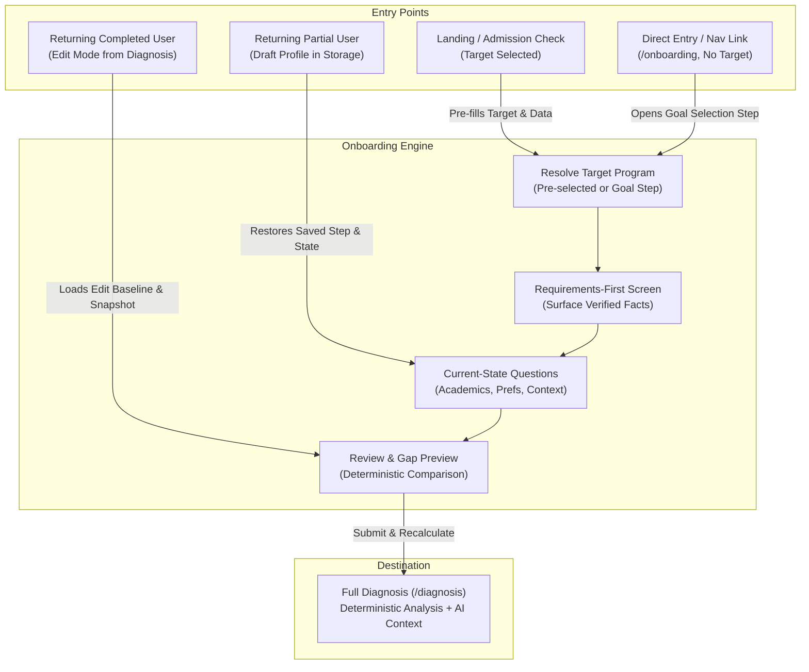

# Fortech Onboarding Specification — Hackathon Release

## 0. Document Authority & System Architecture

### 0.1 Source of Truth Hierarchy
This specification defines the onboarding experience for Fortech for the hackathon release. It is governed strictly by the repository rules and architectural guardrails defined in:
1. `AGENTS.md` (Git workflow, deterministic vs. AI ownership, student safety, scoring rules, non-manipulation);
2. `docs/FORTECH_MASTER_TZ.md` (Master product technical specification, P0 requirements, data models, trust model);
3. `docs/IMPLEMENTATION_PLAN.md` (Execution order, phase gates, task boundaries).

If any question or ambiguity arises, this document derives its authority directly from `docs/FORTECH_MASTER_TZ.md` and the existing codebase. No coding agent or developer shall invent new product requirements, scoring coefficients, external dependencies, or admission rules outside this specification.

### 0.2 The Core Product Loop
Onboarding serves as the gateway into Fortech's core product loop:

$$\text{Dream} \longrightarrow \text{Requirements} \longrightarrow \text{Current State} \longrightarrow \text{Gap} \longrightarrow \text{Plan} \longrightarrow \text{Progress} \longrightarrow \text{Recalculation}$$

The onboarding flow avoids arbitrary questionnaire hurdles. Instead, it maintains a transparent, student-centered structure:
1. **Dream (Goal)**: The student chooses the target university and degree program they want to pursue.
2. **Requirements**: Fortech presents the verified admission requirements and published criteria for that chosen program before asking for academic scores.
3. **Current State**: The student supplies their current study stage, available scores, language preferences, and budget. Unanswered fields remain unknown.
4. **Gap**: The review screen presents a transparent, evidence-based gap comparison between target requirements and current profile values.
5. **Plan**: On submission, the student navigates to `/diagnosis`, which computes deterministic eligibility, strengths, gaps, missing information, and primes the roadmap.

### 0.3 Core Product Principles
- **Show, don't tell**: Demonstrate product capabilities through verified program facts and deterministic calculations rather than generic marketing claims.
- **Goal-first, not form-first**: Anchor the experience to a concrete goal (*"Where do you want to get in?"*) rather than opening with abstract inputs like GPA.
- **Facts first, AI second**: Admission requirements, eligibility states, fit scores, and deadlines are computed deterministically from structured verified records. AI serves solely to explain, contextualize, and summarize. AI never calculates eligibility, fit scores, or admissions facts.
- **Honest uncertainty**: Unknown data remains unknown (`null`). Unanswered fields or unverified program requirements must never be treated as failure or negative score penalties.
- **Student safety & dignity**: The target demographic includes school-age adolescents (Grades 10–12). The interface strictly prohibits fear-based language, artificial rejection warnings, or FOMO-driven urgency. Urgency originates solely from published calendar deadlines and verified prerequisite requirements.

---

## 1. Current Behavior vs Target Behavior

This section establishes a clear boundary between what is currently working in the repository, what is required by the Master TZ for subsequent tasks, and what is out of scope.

### 1.1 Behavior Already Implemented Today
The repository currently implements a working baseline across the following areas:
- **Four-Step Onboarding Layout**:
  - Step 1: Direction (`currentStudyStage`, `targetDegree`, `intendedField`).
  - Step 2: Academics (`gpa`, `ieltsScore`, `satScore`).
  - Step 3: Preferences (`preferredCountries`, `preferredLanguage`, `annualBudget`, `budgetCurrency`, `targetIntake`).
  - Step 4: Review (`ProfilePreview`, review sections with edit buttons, trust explanation, submit button).
- **Validation Rules in `lib/onboarding.ts`**:
  - `currentStudyStage`: Required on Step 1 (`"Grade 10"`, `"Grade 11"`, `"Grade 12"`, `"Undergraduate student"`, `"Graduate"`).
  - `targetDegree`: Required on Step 1 (must equal `"Bachelor"`).
  - `intendedField`: Required on Step 1 (must equal `"Computer Science"` or `"Business"`).
  - `gpa`: Optional; if provided, must be in range `[0, 4]`.
  - `ieltsScore`: Optional; if provided, must be in range `[0, 9]`.
  - `satScore`: Optional; if provided, must be in range `[400, 1600]`.
  - `annualBudget`: Optional; if provided, must be $> 0$.
  - `targetIntake`: Required on Step 3 and Step 4 (`"Fall 2027"`, `"Spring 2028"`, `"Fall 2028"`).
- **Language of Instruction Integration**:
  - `UniversityProgram.languageOfInstruction` is typed as `string | null` in `types/admissions.ts`.
  - `StudentProfile.preferredLanguage` is typed as `string | null` in `types/admissions.ts`.
  - `onboarding-form.tsx` derives selectable languages dynamically from verified non-null program values in `data/programs.ts`. In the current dataset, this resolves strictly to `["English"]`, alongside `"No preference"` (`null`).
  - Language alignment is displayed in `lib/admissions/presentation.ts` and `lib/admissions/recommend.ts` as explanatory evidence (`Match`, `Action needed`, `Needs verification`, `Not required`).
  - `preferredLanguage` has **zero effect** on numeric Fit Score in `lib/admissions/scoring.ts` and **zero effect** on eligibility in `lib/admissions/eligibility.ts`.
- **Deterministic Scoring & Eligibility**:
  - `calculateFit()` computes weights across 6 components: `fieldFit` (25), `academicFit` (20), `budgetFit` (20), `languageFit` [IELTS] (15), `countryPreference` (10), `timelineFit` (10). Total maximum: 100 points.
  - `evaluateEligibility()` determines eligibility status (`eligible_now`, `with_actions`, `not_eligible`, `requires_verification`) based on GPA, IELTS, and SAT against published program requirements.
- **Persistence & Sync**:
  - Browser persistence in `localStorage` under `admission-journey:v1:profile` and `admission-journey:v1:selected-program`.
  - Timestamp-based conflict resolution in `lib/supabase/sync.ts` (`chooseNewer`): newer `updatedAt` wins between local and remote records.
  - `useClientReady()` avoids hydration mismatches during client storage initialization.
- **Edit Baseline & Change Impact**:
  - Baseline stored in `admission-journey:v1:edit-baseline` when editing a completed profile.
  - `buildChangeImpact()` calculates metric and program changes on submission, stored in `admission-journey:v1:change-impact`.
- **Post-Onboarding Destination**:
  - On submission, user is routed to `/diagnosis`.

### 1.2 Behavior Required by Master TZ but Not Yet Implemented
These capabilities are specified in `docs/FORTECH_MASTER_TZ.md` and scheduled in `docs/IMPLEMENTATION_PLAN.md` for upcoming feature tasks:
- **Task 3 (`feature/activities-context`)**:
  - Addition of optional `activitiesAndAchievements?: string | null` to `StudentProfile`.
  - Optional free-text input on Step 3 for extracurriculars, olympiads, and projects.
  - Contextual use in Diagnosis Strengths and Roadmap application preparation tips; strictly 0 scoring weight.
- **Task 4 (`feature/goal-first-target`)**:
  - Re-ordering the entry point so users select a specific target (`[Program] @ [University]`) from verified catalog data before being asked detailed profile questions.
  - Requirements-first screen revealing verified program criteria (academics, IELTS, SAT, instruction language, documents, deadlines, tuition) prior to academic questionnaires.
- **Task 5 (`feature/instant-diagnosis`)**:
  - Landing-page instant admission check displaying mini-diagnosis before signup/account creation.
- **Task 6 (`feature/onboarding-prefill`)**:
  - Full state transfer from the instant check into onboarding, ensuring any data provided during pre-onboarding is pre-filled and never asked a second time.
  - Side-by-side Target vs. Current State gap comparison table on Step 4 Review.

### 1.3 Optional / Future Ideas that Are NOT Current Requirements
The following items are explicitly **not** requirements for the current hackathon release:
- **Climate / Environment Preferences**: Excluded by Master TZ Section 4 (P0.4) due to lack of verified admissions datasets.
- **Automated Currency Conversion**: Excluded; budgets are compared only when program tuition uses the same currency. Speculative exchange rates are not applied.
- **Generic AI Chatbots**: Excluded by Master TZ Section 6 (P2). AI remains an explanation layer for structured data, not an open-ended conversational bot.
- **Social / Competitive Features**: Excluded by Master TZ Section 6 (P2); no peer rankings, public profiles, leaderboards, or follower feeds.
- **Predictive Admission Chances**: Excluded; Fit Score measures profile alignment, never admission probability.
- **Third-Party Telemetry & Invasive Tracking**: Excluded; school-age privacy protections preclude external tracking scripts.

---

## 2. Entry States & Journey Architecture

Onboarding supports four distinct entry states to guarantee user continuity and eliminate redundant input requests.



### 2.1 State A: User Arrives with a Selected Target (Pre-Onboarding Flow)
- **Source**: Visitor engages with the Landing Page Goal-first hero or Instant Check widget (Task 4/5) and selects a specific program (e.g. `aitu-computer-science`).
- **State Hand-off**:
  - `selectedProgramId` is saved in `localStorage` under `admission-journey:v1:selected-program`.
  - Available pre-check inputs (e.g. `currentStudyStage`, preliminary `gpa` or `ieltsScore`) are stored in `admission-journey:v1:profile`.
- **User Experience**:
  - The student does not re-select their target.
  - The flow presents the **Requirements-First** view for their chosen program, showing published criteria.
  - Subsequent steps pre-populate previously supplied fields; only unknown fields are presented.

### 2.2 State B: Direct Entry at `/onboarding` Without a Target
- **Source**: User navigates directly to `/onboarding` via header links or clean session.
- **State Hand-off**:
  - `loadStoredProfile()` returns `null`.
  - `loadSelectedProgram()` returns `null`.
- **User Experience**:
  - User starts at Step 1: Goal & Direction.
  - The student chooses intended study field, confirms target degree (`"Bachelor"`), and selects a target program from Fortech's verified catalog.
  - The Requirements-First preview reveals published criteria for the selected program.

### 2.3 State C: Returning User with Partial Profile (Draft Restoration)
- **Source**: User returns to `/onboarding` after partially completing steps in a prior session.
- **State Hand-off**:
  - `loadStoredProfile()` returns a valid `StoredProfile` with `completed === false` and `step` $\in \{1, 2, 3\}$.
- **User Experience**:
  - `useClientReady()` restores the user's progress.
  - The student resumes on the step where they left off, with all saved inputs intact.

### 2.4 State D: Returning User with Completed Profile (Edit Mode)
- **Source**: Existing user clicks "Edit admission profile" from `/diagnosis`, `/matches`, or `/roadmap`.
- **State Hand-off**:
  - `loadStoredProfile()` returns `StoredProfile` with `completed === true`.
  - `saveEditBaseline(initial.profile)` takes a snapshot in `admission-journey:v1:edit-baseline` for Change Impact detection.
- **User Experience**:
  - User opens the review step (Step 4) or navigates into any specific step via the in-page edit controls.
  - When the user modifies fields and resubmits, the system computes the diff via `buildChangeImpact()` and redirects to `/diagnosis` with Change Impact notifications.

---

## 3. Goal-First Behavior & Target Entity

### 3.1 The "Dream First" Entry Interaction
In accordance with Master TZ Section 3.2, Fortech begins with a goal-first anchor:
> *"Where do you want to get in?"*

Rather than asking for grades first, the flow invites the student to identify their ambition:
1. **Intended Study Field**: High-level academic interest (`"Computer Science"` or `"Business"`).
2. **Target University & Program**: Concrete program from Fortech's verified catalog (e.g. *Computer Science @ Astana IT University* or *Software Systems Engineering @ LUT University*).
3. **Target Intake**: Application cycle (`"Fall 2027"`, `"Spring 2028"`, `"Fall 2028"`).

### 3.2 Target University & Program Selection
- **Catalog Grounding**: The selection list is populated strictly from the verified `programs` dataset in `data/programs.ts`. Users select verified offerings; free-text entry of unverified institutions is not permitted.
- **Selection Component**:
  - Card or searchable list grouping programs by University and Country.
  - Each item displays: `universityName`, `programName`, `country`, `city`, and `degreeLevel`.
  - Selecting an item updates the selected target program.
- **Catalog Scope**:
  - Current catalog coverage supports verified Bachelor programs in Computer Science and Business disciplines.

### 3.3 Target Intake & Degree Constraints
- **`targetDegree`**:
  - `StudentProfile.targetDegree` is **not** inferred or copied from `program.degreeLevel`.
  - In the current repo implementation, `StudentProfile.targetDegree` is selected by the student and validated to strictly equal `"Bachelor"`.
- **`intendedField`**:
  - Selected by the student on Step 1 (`"Computer Science"` or `"Business"`).
- **`targetIntake`**:
  - Selected by the student (`"Fall 2027"`, `"Spring 2028"`, or `"Fall 2028"`).

### 3.4 Target Program Storage Mapping
When a target program is selected:
- The program's unique ID is committed to storage using `saveSelectedProgram(program.id)`.
- The full `UniversityProgram` object is retrieved via `programs.find(p => p.id === selectedId)`.
- The target program is referenced as `[Program Name] @ [University Name]` across Onboarding, Diagnosis, Matches, and Roadmap.

### 3.5 No Automatic Side Effects on `preferredCountries`
- Selecting a target university, program, or country must **NOT** automatically populate or overwrite `preferredCountries`.
- `preferredCountries` remains controlled exclusively by student input via the country selection checkboxes in Step 3.

---

## 4. Requirements-First Screen (The Cognitive Anchor)

### 4.1 Cognitive Model: Requirements Before Questions
Master TZ Section 4 (P0.6) mandates that known program requirements be displayed **before** asking the student for detailed personal academic metrics.

**Rationale**:
- Providing a GPA or test score in isolation lacks clear motivation.
- Displaying program requirements first provides immediate context:
  > *"Astana IT University requires an academic UNT score (minimum 70) and a high school diploma. Now, let's see where you stand today."*
- Every subsequent input field has an immediate, student-understood purpose.

### 4.2 Displayed Program Requirements Matrix
When a target program is loaded, Fortech presents the following verified requirements:

| Requirement Category | Program Data Field | Displayed Information | Status Badge |
| :--- | :--- | :--- | :--- |
| **Academic Baseline** | `program.academicRequirement` | Requirement label (e.g. "UNT"), minimum score, or qualification notes. | `Verified Requirement` or `Qualification-specific` |
| **Language of Instruction** | `program.languageOfInstruction` | Teaching language (e.g. "English"). | `Verified` or `Needs verification` (`null`) |
| **English Proficiency** | `program.ieltsRequirement` | Minimum IELTS score (e.g. "6.5 minimum") or whether English proof is required. | `Verified Requirement` or `Not required` or `Needs verification` |
| **Standardized Tests** | `program.satRequirement` | Minimum SAT score or explicit exemption status. | `Verified Requirement` or `Not required` or `Needs verification` |
| **Required Documents** | `program.applicationDocuments` | Whether motivation letter or recommendation letters are officially required. | `Verified Requirement` or `Needs verification` |
| **Application Deadline** | `program.deadline` | Published application deadline date. | `Verified Deadline` or `Needs verification` |
| **Tuition Baseline** | `program.tuition`, `tuitionCurrency` | Published tuition fee per year or semester. | `Published Fee` or `Needs verification` |

### 4.3 Verified vs. Unknown Status Taxonomy
Requirement states use neutral, evidence-based badges:
- **Verified Requirement** (`bg-forest-100 text-forest-800`): Fact verified from official university publication with source link.
- **Needs Verification** (`bg-sand-100 text-amber-900`): Requirement exists, but exact score minimums or international conversions are qualification-specific, or data is pending verification.
- **Not Required** (`bg-slate-100 text-slate-700`): Program officially confirms the metric is not mandatory for admission.
- **Unknown / Unverified** (`bg-slate-50 text-muted`): Information not currently verified in the dataset.

### 4.4 Official Provenance & Source Attribution
- Every requirement card includes an official source attribution:
  > *Source: Bachelor admissions · astanait.edu.kz*
- Clicking opens the official university URL in a new tab (`target="_blank" rel="noopener noreferrer"`).
- If a requirement is not verified in `data/programs.ts`, it is marked as `Needs verification` or left blank. No requirements may be hallucinated or generated by AI.

---

## 5. Current-State Questionnaire Specification

### 5.1 Questionnaire Principles
1. **Mandatory Fields**: Only fields strictly required to form a valid directional match are mandatory (`currentStudyStage`, `targetDegree`, `intendedField`, `targetIntake`).
2. **Optional Academic Scores**: Academic GPA, IELTS, SAT, and tuition budget are optional.
3. **Blank Stays Unknown**: Blank numeric fields evaluate to `null`. They are never converted into zeros, failing grades, or penalties.
4. **Context Fields Do Not Affect Scores**: Extracurricular free text and study stage are qualitative context and do not alter deterministic fit scores.

### 5.2 Comprehensive Field-by-Field Matrix

| Field Name | Type | Mandatory? | Input Control | Valid Options / Range | Why We Ask It | Scoring Impact (Fit Score) | Eligibility Impact | Can Prefill? |
| :--- | :--- | :--- | :--- | :--- | :--- | :--- | :--- | :--- |
| `currentStudyStage` | `string \| null` | **Required** (Step 1) | Choice Cards (Radio) | `"Grade 10"`, `"Grade 11"`, `"Grade 12"`, `"Undergraduate student"`, `"Graduate"` | Tailors guidance and preparation timeline. | **None** (0 weight in `scoring.ts`). | **None** (Not in `eligibility.ts`). | Yes (from Landing / Instant Check). |
| `targetDegree` | `string \| null` | **Required** (Step 1) | Choice Card (Radio) | Must equal `"Bachelor"` | Sets degree level in scope. | Filters eligible catalog. | Program eligibility gate. | Yes (defaults to `"Bachelor"`). |
| `intendedField` | `string \| null` | **Required** (Step 1) | Choice Cards (Radio) | `"Computer Science"`, `"Business"` | Shapes primary program recommendations. | **25% weight** (`fieldFit` in `scoring.ts`). | Evaluated against program field. | Yes (from Landing / selected target). |
| `gpa` | `number \| null` | Optional (Step 2) | Numeric Input | Decimal `0.00` – `4.00`, step `0.01` | Evaluates academic prerequisite if published. | **20% weight** (`academicFit` in `scoring.ts`). | Gate if minimum required; blank = `requires_verification`. | Yes (from Landing / Instant Check). |
| `ieltsScore` | `number \| null` | Optional (Step 2) | Numeric Input | Decimal `0.0` – `9.0`, step `0.5` | Evaluates English language threshold. | **15% weight** (`languageFit` in `scoring.ts`). | Improvable gap if below min; blank = `requires_verification`. | Yes (from Landing / Instant Check). |
| `satScore` | `number \| null` | Optional (Step 2) | Numeric Input | Integer `400` – `1600`, step `10` | Evaluates standardized test threshold where required. | Improvable gap if required; neutral if not required. | Improvable gap if required and below minimum. | Yes (from Landing / Instant Check). |
| `preferredCountries` | `string[]` | Optional (Step 3) | Multi-select Checkboxes | Countries in catalog: `"Finland"`, `"Germany"`, `"Kazakhstan"`, `"Poland"` | Narrows geographic preferences. | **10% weight** (`countryPreference`). Empty = full weight. | **None** (Not in `eligibility.ts`). | **No** (Controlled only by user selection). |
| `preferredLanguage` | `string \| null` | Optional (Step 3) | Select Dropdown | Verified non-null program values: `"English"`, plus `"No preference"` (`null`) | Identifies preferred instruction language. | **None** (0 weight in `scoring.ts`). | **None** (Not in `eligibility.ts`). Explanatory context only. | Yes (from stored profile). |
| `annualBudget` | `number \| null` | Optional (Step 3) | Numeric Input | Integer $> 0$, step `500` | Assesses tuition affordability against published rates. | **20% weight** (`budgetFit`) only if currencies match. | **None** (Not in `eligibility.ts`). | Yes (from stored profile). |
| `budgetCurrency` | `string \| null` | Optional (Required if budget set) | Select Dropdown | Currencies in catalog: `"EUR"`, `"KZT"`, `"PLN"`, `"USD"` | Ensures direct currency comparability. | Required to compute `budgetFit`. Differing currency = null fit. | **None** (Not in `eligibility.ts`). | Yes (from stored profile). |
| `targetIntake` | `string \| null` | **Required** (Step 3, 4) | Select Dropdown | `"Fall 2027"`, `"Spring 2028"`, `"Fall 2028"` | Anchors application timeline and milestones. | **10% weight** (`timelineFit` in `scoring.ts`). | **None** (Not in `eligibility.ts`). | Yes (from stored profile). |
| `activitiesAndAchievements` | `string \| null` | Optional (Step 3, Task 3) | Multiline Textarea | Free-text string | Qualitative context for personal statements and CV. | **None** (0 weight in `scoring.ts`). | **None** (Not in `eligibility.ts`). Diagnosis/Roadmap context. | Yes (from stored profile). |

---

### 5.3 Detailed Field Specifications

#### 1. `currentStudyStage`
- **Label**: Current study stage
- **Input Type**: Choice Cards (Radio group)
- **Options**:
  - Primary: `Grade 10`, `Grade 11`, `Grade 12`
  - Secondary (expandable details): `Undergraduate student`, `Graduate`
- **Mandatory**: **Yes** (enforced on Step 1: `if (!profile.currentStudyStage) errors.currentStudyStage = "Choose your current study stage."`).
- **Helper Copy**: *"Helps tailor your guidance. It does not change deterministic matching."*
- **Scoring & Eligibility Impact**: Strictly 0 weight. Does not affect Fit Score or eligibility.
- **Display**: Displayed in Diagnosis profile summary under Goal as `Current stage: [Value]`.

#### 2. `targetDegree`
- **Label**: Your target
- **Input Type**: Choice Card (Radio)
- **Options**: `Bachelor` (Badged: *"Supported in this version"*)
- **Mandatory**: **Yes** (enforced on Step 1: `if (profile.targetDegree !== "Bachelor") errors.targetDegree = "Choose the supported Bachelor journey."`).
- **Inference Rule**: `targetDegree` must **NOT** be inferred or copied from `program.degreeLevel`. Current `StudentProfile.targetDegree` remains `"Bachelor"` as selected by the student.

#### 3. `intendedField`
- **Label**: Intended field
- **Input Type**: Choice Cards (Radio group with descriptions)
- **Options**:
  - `Computer Science` — *"Software, data, IT and digital systems"*
  - `Business` — *"Management, finance, analytics and business"*
- **Mandatory**: **Yes** (enforced on Step 1: `if (!profile.intendedField) errors.intendedField = "Choose the field you want to study."`).
- **Scoring Impact**: 25% weight (`fieldFit` in `lib/admissions/scoring.ts`). Evaluated via `fieldsMatch()` against `program.field` using `relatedFieldGroups`. Match = 25 points; mismatch = 0 points.

#### 4. `gpa` (Grade Point Average)
- **Label**: GPA (Optional)
- **Input Type**: Decimal number input (`inputMode="decimal"`)
- **Validation**: If entered, must satisfy `0.0 <= gpa <= 4.0`. Step: `0.01`. Error: *"Enter a GPA between 0 and 4."*
- **Helper Copy**: *"Add your GPA on the supported 0–4 scale, if you know it."*
- **Scoring Impact**: 20% weight (`academicFit` in `lib/admissions/scoring.ts`). Evaluated proportionally against `program.academicRequirement.minimumScore`.
- **Eligibility Impact**: If program has a mandatory minimum academic score and `gpa < minimumScore`, eligibility resolves to `not_eligible`. If left blank and requirement is mandatory, resolves to `requires_verification`.
- **Blank Behavior**: Blank evaluates to `null`. Never scored as 0 or failure.

#### 5. `ieltsScore`
- **Label**: IELTS (Optional)
- **Input Type**: Decimal number input (`inputMode="decimal"`)
- **Validation**: If entered, must satisfy `0.0 <= ieltsScore <= 9.0`. Step: `0.5`. Error: *"Enter an IELTS score between 0 and 9."*
- **Helper Copy**: *"Haven’t taken IELTS yet? Leave this blank; the requirement stays unknown until program facts are checked."*
- **Scoring Impact**: 15% weight (`languageFit` in `lib/admissions/scoring.ts`). Proportional score against `program.ieltsRequirement.minimumScore`.
- **Eligibility Impact**: If `ieltsScore < minimumScore` on a required IELTS requirement, flags an improvable gap (`with_actions`). If left blank and required, resolves to `requires_verification`.
- **Blank Behavior**: Blank evaluates to `null`.

#### 6. `satScore`
- **Label**: SAT (Optional)
- **Input Type**: Number input (`inputMode="numeric"`)
- **Validation**: If entered, must satisfy `400 <= satScore <= 1600`. Step: `10`. Error: *"Enter an SAT score between 400 and 1600."*
- **Helper Copy**: *"Leave blank if not taken. Missing SAT is not treated as a failed score."*
- **Scoring & Eligibility Impact**: If required and below minimum, flags an improvable gap (`with_actions`). If `satRequirement.isRequired === false`, missing SAT has no negative effect.
- **Blank Behavior**: Blank evaluates to `null`.

#### 7. `preferredCountries`
- **Label**: Preferred countries (Optional)
- **Input Type**: Multi-select checkboxes
- **Options**: Dynamically sorted from distinct non-null `country` values in `data/programs.ts` (`"Finland"`, `"Germany"`, `"Kazakhstan"`, `"Poland"`).
- **Helper Copy**: *"Countries currently covered by our verified program set. Select every location you would seriously consider."*
- **Scoring Impact**: 10% weight (`countryPreference` in `lib/admissions/scoring.ts`). If empty array, awards full 10 points (no geographic filter). If non-empty, awards 10 points if `program.country` matches any selected country; 0 if not.
- **Automatic Population Prohibition**: Selecting a target university, program, or country must **NOT** automatically populate `preferredCountries`. `preferredCountries` is modified only when the student explicitly checks or unchecks country options.

#### 8. `preferredLanguage`
- **Label**: What language would you prefer to study in? (Optional)
- **Input Type**: Select dropdown
- **Options**: Derived **only** from verified non-null `UniversityProgram.languageOfInstruction` values in the current dataset, plus `"No preference"`:
  - Current dataset option: `"English"`
  - Default / unset option: `"No preference"` (`null` / empty string)
- **Helper Copy**: *"Choose from languages verified in the current program set. Leave blank if you have no preference."*
- **Scoring Impact**: **Strictly 0 weight**. Does **NOT** affect numeric Fit Score in `lib/admissions/scoring.ts`.
- **Eligibility Impact**: Does **NOT** affect deterministic eligibility in `lib/admissions/eligibility.ts`.
- **Explanatory Context Role**:
  - In `lib/admissions/presentation.ts`, language alignment is presented as an explanatory criterion:
    - If `preferredLanguage === null`: status `"Not required"`, detail *"No language preference is set, so this does not affect your profile alignment."*
    - If `program.languageOfInstruction === null`: status `"Needs verification"`, detail *"The current verified program data does not state the teaching language."*
    - If normalized values match: status `"Match"`, detail *"This program is taught in your preferred language."*
    - If normalized values differ: status `"Action needed"`, detail *"The program language differs from your preference. Confirm that it works for you."*
  - In `lib/admissions/recommend.ts`: surfaced in recommendation reasons (`"Taught in your preferred language"`) or gaps (`"Program is taught in X; your preference is Y"`).

#### 9. `annualBudget` & `budgetCurrency`
- **Label**: Annual tuition budget (Optional)
- **Input Type**: Dual input — Currency select dropdown + number input
- **Currencies**: Dynamically sorted from distinct non-null `tuitionCurrency` values in `data/programs.ts` (`"EUR"`, `"KZT"`, `"PLN"`, `"USD"`).
- **Validation**: If `annualBudget` is provided, must be $> 0$. Step: `500`. Error: *"Enter a tuition budget greater than 0, or leave it blank."*
- **Helper Copy**: *"Tuition only · living costs are not included."*
- **Comparison Rule**: *"We compare budget only when program tuition is published in the same currency. We do not guess exchange rates."*
- **Scoring Impact**: 20% weight (`budgetFit` in `lib/admissions/scoring.ts`). Calculated via `Math.min(1, profile.annualBudget / program.tuition) * 20` only when `profile.budgetCurrency === program.tuitionCurrency` and `tuitionPeriod === "year"`. If currencies differ, `budgetFit` is `null` and excluded from scoring coverage.

#### 10. `targetIntake`
- **Label**: Target intake
- **Input Type**: Select dropdown
- **Options**: `"Fall 2027"`, `"Spring 2028"`, `"Fall 2028"`
- **Mandatory**: **Yes** (enforced on Step 3 and Step 4: `if (!profile.targetIntake) errors.targetIntake = "Choose a target intake."`).
- **Helper Copy**: *"Choose the existing intake that best matches your application timeline."*
- **Scoring Impact**: 10% weight (`timelineFit` in `lib/admissions/scoring.ts`). Awards 10 points if intake year matches program deadline year; 0 if they differ; null if year cannot be extracted.

#### 11. `activitiesAndAchievements` (Planned Task 3 / P0.4)
- **Label**: Olympiads, projects, volunteering, or other achievements (Optional)
- **Input Type**: Multiline textarea
- **Mandatory**: Optional (`activitiesAndAchievements?: string | null`).
- **Helper Copy**: *"This provides context for your plan and does not affect deterministic matching."*
- **Scoring Impact**: **Strictly 0 weight**. Does not affect Fit Score or eligibility.
- **Context Role**: Surfaces in Diagnosis Strengths and Roadmap guidance. No arbitrary character limits are imposed beyond natural input boundaries.

---

### 5.4 Step Sequence Architecture

```
[ Step 1: Goal & Direction ] ──▶ [ Step 2: Academics ] ──▶ [ Step 3: Preferences ] ──▶ [ Step 4: Review ]
```

- **Step 1: Goal & Direction**
  - Choose study direction / target program (`[Program] @ [University]`).
  - Surface Requirements-First preview.
  - Set `targetDegree` (`"Bachelor"`).
  - Set `intendedField` (`"Computer Science"` or `"Business"`).
  - Set `currentStudyStage` (`"Grade 10"`, `"Grade 11"`, `"Grade 12"`, `"Undergraduate student"`, or `"Graduate"`).
- **Step 2: Academics**
  - Banner: *"Blank means unknown. We never turn a missing score into a pass or a fail."*
  - Optional academic inputs: `gpa`, `ieltsScore`, `satScore`.
- **Step 3: Preferences & Context**
  - `preferredCountries` (checkboxes).
  - `preferredLanguage` (select dropdown from verified program languages).
  - `annualBudget` and `budgetCurrency`.
  - `targetIntake` (select dropdown).
  - `activitiesAndAchievements` (context textarea, planned Task 3).
- **Step 4: Review & Admission Profile**
  - Grouped review cards: Goal, Academics, Preferences.
  - Edit button per section allowing users to return directly to that step.
  - Trust notice explaining deterministic matching and AI boundaries.
  - Submit button: *"Analyze my profile"*.

---

## 6. State Transfer, Persistence & Synchronization

### 6.1 Pre-Onboarding Data Carryover
To satisfy Master TZ Section 4 (P0.9):
- Any input entered during pre-onboarding (such as on the Landing page instant check) is saved to browser storage.
- When opening `/onboarding`, inputs already provided are populated automatically.
- Users are never asked to re-enter data that has already been provided.

### 6.2 Browser Storage Contracts
Data is persisted in browser `localStorage` using versioned keys:
- **`admission-journey:v1:profile`**:
  ```ts
  export type StoredProfile = {
    version: 1;
    profile: StudentProfile;
    step: number;        // Active step (1..4)
    completed: boolean;   // True after Step 4 submission
    updatedAt: string;   // ISO-8601 timestamp
  };
  ```
- **`admission-journey:v1:selected-program`**: Stores the target program ID string (e.g. `"aitu-computer-science"`).
- **`admission-journey:v1:edit-baseline`**: Stores `StudentProfile` snapshot when editing an already completed profile.
- **`admission-journey:v1:change-impact`**: Stores the computed `ChangeImpact` diff after updating a profile.

### 6.3 Hydration & Reactive State Management
- Storage is loaded client-side via `useClientReady()`, rendering a fallback state (*"Restoring your saved progress…"*) until mounted to prevent SSR hydration mismatches.
- Field modifications trigger `saveStoredProfile(profile, step, completed)`.
- Page refreshes restore the current step and input values.

### 6.4 Edit Baseline & Change Impact Protocol
When a returning user with a completed profile (`completed === true`) modifies profile values:
1. `saveEditBaseline(initial.profile)` stores the baseline snapshot.
2. Upon submitting Step 4, `buildChangeImpact(previousProfile, profile, previousMatches, newMatches)` compares:
   - Metric changes (e.g. `IELTS 6.0 → 7.0`);
   - Program eligibility transitions and gap changes;
   - Human-readable summary rows.
3. If changes exist, `saveRecentChangeImpact(impact)` persists the diff.
4. `/diagnosis` renders the Change Impact banner explaining the exact consequences of the update.

### 6.5 Persistence Sync Semantics: Newer `updatedAt` Wins
Background cloud synchronization in `lib/supabase/sync.ts` follows deterministic timestamp-based conflict resolution:
```ts
export function chooseNewer<T extends { updatedAt: string }>(local: T | null, remote: T | null) {
  if (!local) return remote ? { source: "remote" as const, value: remote } : null;
  if (!remote) return { source: "local" as const, value: local };
  return Date.parse(remote.updatedAt) > Date.parse(local.updatedAt)
    ? { source: "remote" as const, value: remote }
    : { source: "local" as const, value: local };
}
```
- **Conflict Resolution Rule**: **Newer `updatedAt` wins**.
- If `remote.updatedAt > local.updatedAt`, the remote record updates local storage.
- If `local.updatedAt >= remote.updatedAt`, the local record updates remote storage.
- Local state is **not** unconditionally authoritative; the latest valid update takes precedence across devices.
- If cloud sync is offline or unconfigured, the platform operates without interruption using local storage.

---

## 7. Conditional Logic & Data Integrity

### 7.1 Non-Intrusive Defaults & Validations
- `intendedField` must be selected by the user (`"Computer Science"` or `"Business"`).
- `targetDegree` must be selected by the user and must equal `"Bachelor"`.
- Missing required fields block progression with specific inline error copy.

### 7.2 The Rule of Honest Uncertainty
In accordance with AGENTS.md Section 5:
- An unanswered numeric field (`gpa === null`, `ieltsScore === null`, `satScore === null`, `annualBudget === null`) is never treated as 0 or failing.
- In `lib/admissions/eligibility.ts`:
  - An unknown required criterion evaluates to `requires_verification`, **not** `not_eligible`.
- In `lib/admissions/scoring.ts`:
  - Unknown fields return `null` and are excluded from both earned points and data coverage weighting.

### 7.3 Separation of Concerns: Deterministic Logic vs. AI
- **Deterministic logic owns**:
  - Admissions requirements;
  - Eligibility rules (`eligible_now`, `with_actions`, `not_eligible`, `requires_verification`);
  - Scoring and fit calculation (`calculateFit`);
  - Deadlines and language alignment;
  - Gap and strength calculation;
  - Change impact diffing.
- **AI owns**:
  - Human-readable explanations of deterministic findings;
  - Summarization of priority next actions;
  - Contextual guidance.
- AI must never fabricate requirements, deadlines, test minimums, tuition, or acceptance chances. AI is not invoked on onboarding step transitions.

---

## 8. Review Screen & Gap Preview (Step 4)

### 8.1 Purpose & Mental Model
Step 4 allows the student to review their complete profile before generating their full analysis. It serves as an evidence-based check where the student can verify what is known and what remains unknown.

### 8.2 Layout & Components
Step 4 includes:
1. **Title & Subtitle**: *"Your admission profile is ready"* — *"Review the information that will shape your deterministic analysis."*
2. **Review Sections with Edit Actions**:
   - **Goal**: Target degree, intended field, and current study stage. Includes `Edit` button targeting Step 1.
   - **Academics**: GPA, IELTS, and SAT. Includes `Edit` button targeting Step 2.
   - **Preferences**: Preferred countries, preferred language of instruction, annual tuition budget, and target intake. Includes `Edit` button targeting Step 3.
3. **Missing Intake Warning**: If `targetIntake` was cleared or unselected, an alert states: *"Add a target intake in Preferences before analysis."*
4. **How We'll Use This (Trust Notice)**:
   - Match profile against verified program data.
   - Keep unknown information unknown.
   - Separate profile fit from eligibility — Fit Score is not admission probability.
   - AI may explain results, but cannot change eligibility, Fit Score, or verified program facts.
5. **Footer Actions**:
   - `Back` button to return to Step 3.
   - Primary submit button: `Analyze my profile`.

### 8.3 Target vs. Current State Gap Comparison Matrix
When a target program is selected (via Task 4/6), Step 4 includes a side-by-side gap comparison:

| Metric | Target Requirement (Verified) | Current Input | Status |
| :--- | :--- | :--- | :--- |
| **Academic Standing** | Published program requirement | Student GPA (0–4 scale) | `Ready` / `Needs verification` |
| **English Proficiency** | Published IELTS minimum | Student IELTS score | `Ready` / `Action needed` / `Needs verification` |
| **Standardized Test** | Published SAT minimum or not required | Student SAT score | `Ready` / `Not required` / `Needs verification` |
| **Language of Instruction** | Published teaching language | Preferred language | `Match` / `Action needed` / `Needs verification` |
| **Annual Tuition** | Published tuition per year | Student budget | `Ready` / `Needs verification` |
| **Target Intake** | Application cycle deadline | Student target intake | `Ready` / `Action needed` |

---

## 9. Completion Behavior & Downstream Handoff

### 9.1 Primary Destination: `/diagnosis`
Upon clicking `"Analyze my profile"`:
1. `saveStoredProfile(profile, 4, true)` writes `completed: true` to `localStorage`.
2. Router navigates directly to `/diagnosis`.
3. `/diagnosis` serves as the primary post-onboarding result, presenting:
   - Target summary;
   - Requirement coverage;
   - Strengths (`diagnosis.strengths`);
   - Gaps (`diagnosis.gaps`);
   - Unknown/verification items (`diagnosis.missingInformation`);
   - Next priority actions;
   - AI contextual explanation.

### 9.2 Execution Handler Sequence on Submit
```ts
function submit(event: React.FormEvent<HTMLFormElement>) {
  event.preventDefault();
  if (!validStep(step, profile)) {
    setAttemptedStep(step);
    return;
  }

  setAttemptedStep(null);
  if (step < 4) {
    setStep((current) => current + 1);
    return;
  }

  setCompleted(true);
  const previousProfile = loadEditBaseline();
  if (previousProfile) {
    const impact = buildChangeImpact(
      previousProfile,
      profile,
      getPrimaryMatches(previousProfile),
      getPrimaryMatches(profile),
    );
    if (impact.programChanges.length > 0) saveRecentChangeImpact(impact);
    else clearRecentChangeImpact();
  } else {
    clearRecentChangeImpact();
  }
  clearEditBaseline();
  saveStoredProfile(profile, 4, true);
  router.push("/diagnosis");
}
```

### 9.3 Deterministic Outputs Computed
On `/diagnosis`:
- `diagnoseProfile(profile)` evaluates strengths, gaps, and missing items.
- `getPrimaryMatches(profile)` ranks programs based on `calculateFit()`.
- `evaluateEligibility(profile, program)` assigns eligibility status for matching programs.
- Roadmap tasks are generated via `scoreTasks()`.

---

## 10. Mobile & Responsive UX

### 10.1 Responsive Breakpoints & Layout
- Desktop: Two-column layout with sticky left sidebar (`StepProgress` and `ProfilePreview`) and main form panel.
- Mobile ($< 1024\text{px}$): Single-column layout. Left sidebar hidden; sticky mobile progress header rendered above form panel.

### 10.2 Header & Progress Drawer
- Mobile progress header shows:
  - Step counter: `Step X of 4`.
  - Step title.
  - Step percentage (`Math.round((step / 4) * 100)%`).
  - Visual 4-segment progress bar.
  - Collapsible `<details>` drawer: *"Your profile so far · View summary"*, allowing students to inspect entered values on mobile without losing form position.

### 10.3 Form Controls & Virtual Keyboard Input Modes
- GPA and IELTS use `inputMode="decimal"` for numeric decimal entry.
- SAT and budget use `inputMode="numeric"` for integer entry.
- Choice cards and checkboxes have touch targets $\ge 44\text{px}$ in height.

---

## 11. Accessibility & Universal Design (WCAG 2.1 AA)

### 11.1 Semantic HTML Structure & Landmark Roles
- Main layout contained in semantic `<form noValidate>`.
- Sidebar progress wrapped in `<nav aria-label="Onboarding progress">`.
- Grouped choices use `<fieldset>` and `<legend>`.
- All inputs have associated `<label htmlFor="...">`.

### 11.2 Accessible Form Associations & Error Feedback
- Form inputs reference helper copy and errors via `aria-describedby`:
  ```html
  <input
    id="gpa"
    type="number"
    aria-describedby="gpa-help gpa-error"
    aria-invalid="true"
  />
  <p id="gpa-help">Add your GPA on the supported 0–4 scale, if you know it.</p>
  <p id="gpa-error" role="alert">Enter a GPA between 0 and 4.</p>
  ```
- Error messages render with `role="alert"` for immediate screen reader announcement.

### 11.3 Focus Indicators & Keyboard Order
- Visible keyboard focus styling: `focus-visible:outline-2 focus-visible:outline-offset-2 focus-visible:outline-forest-600`.
- Native hidden radio inputs (`className="sr-only"`) maintain accessible focus delegation to parent card labels.
- Tab order follows logical DOM sequence.

### 11.4 Screen Reader Compatibility & Reduced Motion
- Visual progress bar declares `role="progressbar"`, `aria-valuemin={1}`, `aria-valuemax={4}`, `aria-valuenow={step}`, and `aria-label`.
- Transitions and microinteractions respect `prefers-reduced-motion`.

---

## 12. Loading, Error, and Edge-Case Recovery

### 12.1 Client Hydration & Storage Loading States
- `useClientReady()` delays form mounting until client-side hydration completes, rendering a loading placeholder (*"Restoring your saved progress…"*) to prevent mismatch warnings.

### 12.2 Form Validation & Inline Recovery
- `stepErrors(step, profile)` validates input values synchronously.
- If a required field is missing upon clicking `"Continue"`, the step validation triggers, inline error messages display, and navigation pauses until corrected.

### 12.3 Corrupted Storage Safe Fallbacks
- If `localStorage` holds corrupted or schema-incompatible data:
  - `parseStoredProfileValue()` returns `null`.
  - The form safely falls back to `emptyProfile`.
  - The user can proceed with onboarding without application crashes.

### 12.4 Network Resilience
- Onboarding operates 100% client-side via `localStorage`.
- Loss of internet connection does not block form completion or navigation to `/diagnosis`.
- Background Supabase synchronization fails gracefully if offline, without blocking user progress.

---

## 13. Acceptance Criteria & Test Matrix

### 13.1 User Journey Scenarios

#### Scenario 1: Clean First-Time Visitor
- **Given** clean browser storage.
- **When** the user loads `/onboarding`.
- **Then** Step 1 presents required study stage, target degree (`"Bachelor"`), and intended field choices.
- **When** Step 2 loads and user leaves GPA, IELTS, and SAT blank.
- **Then** no validation errors are shown; blank fields remain `null`.
- **When** user completes Step 3 with a valid target intake and submits Step 4.
- **Then** `StoredProfile.completed` is set to `true`, and user is navigated to `/diagnosis`.

#### Scenario 2: Returning User with Draft
- **Given** an incomplete profile in `localStorage` at Step 2.
- **When** user navigates to `/onboarding`.
- **Then** the form restores Step 2 with all previously entered values.

#### Scenario 3: Returning Completed User Editing Profile
- **Given** a completed profile with `ieltsScore: 6.0`.
- **When** user visits `/onboarding`, edits IELTS to `7.0`, and submits Step 4.
- **Then** `saveEditBaseline` records the baseline, `buildChangeImpact` records the delta, and `/diagnosis` reflects the updated score with Change Impact context.

#### Scenario 4: Boundary Validation
- **Given** a user on Step 2 entering GPA `4.5` or IELTS `10.0`.
- **When** user clicks `"Continue"`.
- **Then** navigation is blocked and inline errors are displayed.

### 13.2 Automated Test Coverage Requirements
The onboarding behavior must be verified by automated tests in `lib/onboarding.test.ts`:
- `stepErrors(1, profile)` verifies `currentStudyStage`, `targetDegree === "Bachelor"`, and `intendedField`.
- `stepErrors(2, profile)` verifies score ranges for `gpa`, `ieltsScore`, and `satScore`.
- `stepErrors(3, profile)` verifies `annualBudget > 0` and `targetIntake`.
- `stepErrors(4, profile)` verifies `targetIntake` presence before review submission.
- Optional blank fields evaluate to `null` and do not trigger errors.

---

## 14. Explicit Non-Goals

The following items are explicitly **out of scope** for the onboarding implementation:
1. **AI Provider Alterations**: No changes to `/api/ai/...`, fallback logic, or provider routing.
2. **Social or Competitive Mechanics**: No peer comparison, public profiles, leaderboards, or follower feeds.
3. **Fear / Shame Mechanics**: No countdown urgency timers, rejection warnings, or manipulative microcopy.
4. **Climate / Environment Preferences**: No survey questions regarding weather or lifestyle.
5. **Arbitrary Fit Percentages**: No invented admission probabilities or acceptance odds.
6. **Design System Inventions**: No invented brand palettes or third-party studio font clones.
7. **Application Code Changes in This Branch**: This task is strictly documentation; application code changes will be implemented in dedicated feature branches according to `docs/IMPLEMENTATION_PLAN.md`.
